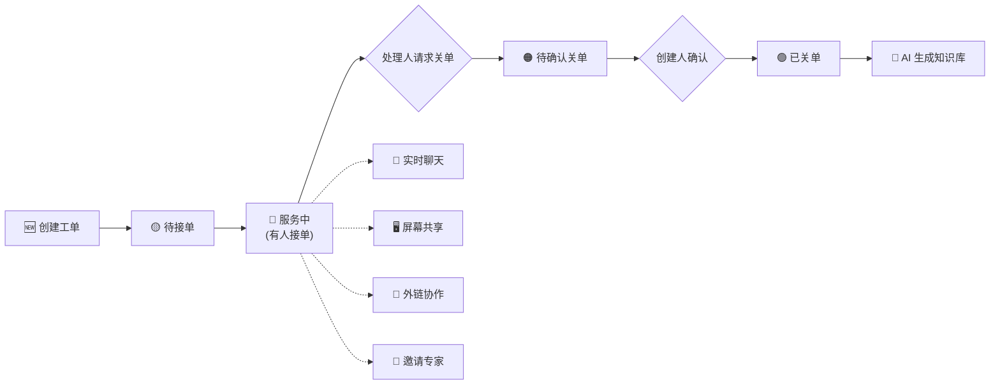

# CallCenter 技术支持系统 — 用户操作手册

> **版本**：V1.0 | **更新日期**：2026年4月23日 | **读者对象**：全体使用人员

---

## 目录

1. [系统简介](#一系统简介)
2. [登录与注册](#二登录与注册)
3. [仪表盘（首页）](#三仪表盘首页)
4. [⭐ 工单模块（核心）](#四工单模块核心)
   - 工单广场
   - 创建工单
   - 工单详情与实时聊天
   - 接单与服务
   - 屏幕共享远程协助
   - 外部链接协作
   - 关单流程
   - 知识库文档生成
5. [知识库](#五知识库)
6. [数据报表](#六数据报表)
7. [技术论坛（BBS）](#七技术论坛bbs)
8. [个人主页](#八个人主页)
9. [全局搜索](#九全局搜索)
10. [后台管理（管理员）](#十后台管理管理员专用)
11. [常见问题](#十一常见问题faq)

---

## 一、系统简介

CallCenter 是一套面向公司二线技术支持团队的**网页版即时通讯与工单协同平台**。系统围绕"技术支持工单"展开，集成了实时聊天、远程屏幕共享、AI 知识库自动生成、RBAC 权限管理和多维度统计报表等功能。

**核心价值**：让每一次技术支持过程都可追溯、可复用、可量化。

### 系统角色一览

| 角色 | 说明 | 典型人员 |
|------|------|---------|
| **超级管理员** (admin) | 拥有所有权限，管理系统配置 | 系统运维人员 |
| **技术总监** (director) | 查看报表、知识库，管理工单 | 部门领导 |
| **技术支持工程师** (tech) | 接单、处理工单、生成知识库 | 二线工程师 |
| **普通用户** (user) | 创建工单、参与聊天 | 一线工程师 |
| **外部用户** (external) | 通过外链进入工单聊天 | 客户/合作伙伴 |

---

## 二、登录与注册

### 2.1 登录

打开系统网址，进入登录页面：

**操作步骤**：
1. 在"用户名"栏输入您的账号
2. 在"密码"栏输入密码
3. 点击 **「登录」** 按钮
4. 登录成功后自动跳转到仪表盘首页

### 2.2 注册新账号

如果您还没有账号，点击登录页下方的 **「注册」** 链接：
1. 填写用户名、真实姓名、邮箱（选填）、密码
2. 点击提交，注册成功后自动登录

> [!NOTE]
> 新注册的账号默认为"外部用户"角色，需要管理员在后台手动调整为对应角色后才能使用完整功能。

---

## 三、仪表盘（首页）

登录成功后进入系统首页——仪表盘：

仪表盘提供以下信息一览：
- **工单统计卡片**：待接单数、服务中数、待确认关单数、已关单数
- **我的待办**：需要您处理的工单列表
- **快捷入口**：一键创建新工单、进入工单广场

左侧导航栏包含系统的所有功能模块，点击即可进入。

---

## 四、⭐ 工单模块（核心）

工单模块是整个系统的核心，覆盖了从"发现问题"到"解决问题"再到"沉淀知识"的完整闭环。

### 4.1 工单广场

点击左侧导航栏的 **「工单广场」** 进入：

工单广场支持以下功能：

| 功能 | 说明 |
|------|------|
| **状态筛选** | 顶部标签页可按"全部 / 待接单 / 服务中 / 待确认 / 已关单"筛选 |
| **搜索** | 输入关键词搜索工单标题、编号、客户名称 |
| **卡片/列表切换** | 右上角可切换为卡片视图或列表视图 |
| **未读红点** | 有新消息的工单会显示红色未读标记 |
| **批量操作** | 勾选多个工单后可执行批量删除 |

**工单状态标识**：
- 🟡 **待接单**：工单已创建，等待技术支持人员接单
- 🔵 **服务中**：已有人接单，正在处理中
- 🟠 **待确认关单**：处理人已提交关单请求，等待创建人确认
- 🟢 **已关单**：工单已关闭

---

### 4.2 创建工单

点击工单广场右上角的 **「+ 新建工单」** 按钮：

**必填项**：
1. **工单标题**：简洁描述问题，例如"客户A现场ESXi无法启动"
2. **问题描述**：详细说明问题现象、环境信息、已尝试的排查步骤
3. **工单类型**：选择软件/硬件/网络/安全/数据库/其他
4. **客户名称**：填写客户公司名称

**选填项**：
- **服务单号**：如有合同中的服务编号可填写
- **工单分类**：三级联动分类选择（支持类型 → 技术方向 → 品牌）

填写完毕后点击 **「提交」**，系统将自动生成唯一的工单编号（如 `TK202604230001`），工单进入 **"待接单"** 状态。

---

### 4.3 工单详情与实时聊天

在工单广场点击任意工单标题，进入工单详情页：

工单详情页分为三个区域：

#### 左侧 — 工单信息面板
显示工单的基本信息：标题、编号、状态、类型、客户名称、创建人、处理人、参与人、创建时间等。

#### 中间 — 实时聊天区
这是工单协作的核心区域，所有相关人员在此实时沟通：

**聊天功能一览**：

| 功能 | 操作方式 |
|------|---------|
| **发送文字** | 在底部输入框输入文字，按 Enter 发送 |
| **发送图片** | 点击输入框左侧的 📎 图标，选择图片上传 |
| **发送文件** | 同上，支持任意文件格式 |
| **消息撤回** | 鼠标悬停在自己发送的消息上，点击出现的「撤回」图标 |
| **消息复制** | 鼠标悬停在消息气泡上，点击「复制」图标 |
| **换行输入** | 按 Shift + Enter 可在消息中换行（不发送） |

> [!TIP]
> 聊天消息会实时推送给所有在该工单房间内的人员（包括通过外链进入的外部用户）。即使对方不在当前页面，也会收到未读红点提醒。

#### 右侧 — 操作按钮区
顶部工具栏提供各种快捷操作按钮（接单、关单、分享等）。

---

### 4.4 接单与服务

当一个新工单处于"待接单"状态时：

**技术支持工程师**进入工单详情页后，点击顶部的 **「接单」** 按钮即可接手该工单：

接单后：
- 工单状态自动变为 **"服务中"**
- 接单人自动成为该工单的处理人
- 系统在聊天区自动发送一条系统消息通知

**邀请其他专家参与**：
如果问题需要多人协作，您可以点击工单信息面板中的 **「邀请参与」** 按钮，搜索并添加其他同事加入工单聊天。被邀请的人将能在"个人主页 → 我参与的工单"中看到该工单。

---

### 4.5 屏幕共享（远程协助）

当需要远程查看客户或同事的桌面环境时，可以使用屏幕共享功能。

**发起共享**：
1. 在工单详情页的顶部工具栏中，点击 **「🖥️ 共享屏幕」** 按钮
2. 浏览器会弹出屏幕选择器，选择要共享的屏幕/窗口/标签页
3. 点击确认后，您的屏幕画面将实时传输给该工单房间内的所有人

**观看共享**：
- 当有人发起屏幕共享时，房间内的其他人会自动收到通知
- 观看面板会出现在聊天区上方，显示实时画面
- 支持**放大画面、全屏、支援模式**（大画面+聊天并排）等操作
- 支持**多人同时观看**同一个人的屏幕

**停止共享**：
- 分享者点击工具栏中的 **「停止共享」** 按钮
- 或直接点击浏览器底部弹出的"停止共享"按钮

> [!IMPORTANT]
> 屏幕共享需要 HTTPS 环境才能正常工作。如果外网用户看到黑屏，请联系管理员检查 WebRTC 穿透配置（TURN 服务器设置）。

---

### 4.6 外部链接协作

当需要让**公司外部的客户或合作伙伴**参与工单沟通时：

1. 在工单详情页的顶部工具栏中，点击 **「🔗 生成外链」** 按钮
2. 系统会生成一个专属的外部访问链接（如 `https://xxx.cc/external/ticket/abc123`）
3. 将此链接通过微信/邮件等方式发送给外部人员
4. 外部人员点击链接后，输入昵称即可以"匿名访客"身份加入聊天

**外部用户可执行的操作**：
- ✅ 发送文字/图片/文件消息
- ✅ 撤回自己发送的消息
- ✅ 观看屏幕共享画面
- ❌ 不可接单、关单、删除工单等管理操作

> [!NOTE]
> 管理员可以在后台设置外链的有效期。如果工单已关闭或外链被手动禁用，外部用户将无法继续访问。

---

### 4.7 关单流程

工单处理完毕后，需要经历一个**双方确认**的关单流程：

**第一步 — 处理人请求关单**：

处理人（接单的技术支持工程师）点击顶部的 **「请求关单」** 按钮：

- 工单状态变为 **"待确认关单"**
- 系统自动通知工单创建人

**第二步 — 创建人确认关单**：

工单的创建人（提单的一线工程师）收到通知后，进入工单详情页，点击 **「确认关单」** 按钮：

- 工单状态变为 **"已关单"**
- 系统记录关单时间，用于后续统计分析

> [!TIP]
> 关单后，工单聊天记录将永久保留，可随时查阅。同时，已关单的工单可以进入知识库模块生成 AI 总结文档。

---

### 4.8 AI 知识库文档生成

工单关闭后，可利用 AI 自动生成标准化的技术知识文档：

1. 进入已关单的工单详情页
2. 点击顶部工具栏的 **「📝 生成知识库」** 按钮
3. 系统将自动调用 AI 引擎（Google Gemini），分析整个工单的聊天记录
4. AI 会生成一份包含"问题描述 → 排查过程 → 解决方案 → 经验总结"的标准 Markdown 文档
5. 您可以在弹窗中预览并编辑 AI 生成的内容
6. 确认无误后点击 **「保存」**，文档将归档到知识库

---

### 4.9 工单完整生命周期图

---

## 五、知识库

点击左侧导航栏的 **「知识库」** 进入：

知识库收录了所有通过 AI 生成或手动编写的技术文档。

**主要功能**：
- **搜索**：输入关键词搜索知识文档标题和内容
- **分类浏览**：按文档类型筛选（AI 知识库 / 聊天记录导出）
- **查看详情**：点击文档标题可查看完整的 Markdown 渲染内容
- **编辑**：有权限的用户可以修改文档内容
- **删除**：管理员可以删除过时的文档
- **导出聊天记录**：支持将工单聊天记录直接导出为文档归档

---

## 六、数据报表

点击左侧导航栏的 **「数据报表」** 进入：

报表模块提供多维度的工单数据可视化分析：

| 报表维度 | 图表类型 | 说明 |
|---------|---------|------|
| **工单总览** | 统计卡片 | 总数、各状态计数、平均处理时长 |
| **问题类型分布** | 饼图 + 柱状图 | 支持三级下钻（大类→中类→小类） |
| **人员工作量** | 柱状图 | 创建/接单/参与三维独立排行 |
| **客户统计** | 横向柱状图 | 按客户汇总工单数和完结率 |
| **时间趋势** | 折线图 | 支持日/月/季/年四种粒度切换 |

**高级功能**：
- **日期范围筛选**：顶部提供时间选择器，可精确查看指定时间段的数据
- **数据下钻**：点击饼图/柱状图中的某个分类，可以逐级下钻到更细的分类
- **矩阵交叉分析**：查看某个技术方向下，哪些工程师处理最多
- **导出 Excel**：点击右上角的 **「📥 导出 Excel」** 按钮，一键导出全量工单数据为 `.xlsx` 文件

---

## 七、技术论坛（BBS）

点击左侧导航栏的 **「技术论坛」** 进入：

技术论坛是团队内部的知识交流平台，用于分享技术文章、经验总结、公告通知等。

**主要功能**：
- **发帖**：点击「发布新帖」，支持 Markdown 编辑器（含实时大纲导航）
- **板块分类**：帖子按板块分类管理（如"技术分享"、"公告"等）
- **标签**：每篇帖子可以添加标签，方便分类检索
- **评论**：在帖子下方可以发表评论进行讨论
- **置顶/归档**：管理员可以对重要帖子进行置顶或归档处理
- **订阅通知**：关注感兴趣的帖子，有新评论时收到实时通知
- **外链分享**：可以生成帖子的公开外链，分享给外部人员查阅

---

## 八、个人主页

点击左侧导航栏的 **「个人主页」** 或右上角头像进入：

**个人主页包含以下内容**：

| 标签页 | 说明 |
|--------|------|
| **我创建的工单** | 您亲自提交的所有工单列表 |
| **我接手的工单** | 您作为处理人接单的所有工单列表 |
| **我参与的工单** | 您被邀请参与协助的所有工单列表 |
| **个人设置** | 修改昵称、真实姓名、头像、密码等 |

---

## 九、全局搜索

点击左侧导航栏的 **「全局搜索」** 或使用快捷入口进入：

全局搜索基于 Elasticsearch 引擎，支持跨模块的全文检索：

**可搜索的内容范围**：
- 🎫 工单标题、描述、编号、客户名称
- 💬 聊天消息内容
- 📝 知识库文档
- 📰 论坛帖子

**搜索结果**：
- 关键词高亮显示
- 按类型分组展示
- 点击搜索结果可直接跳转到对应页面

---

## 十、后台管理（管理员专用）

点击左侧导航栏的 **「后台管理」** 进入（仅管理员可见）：

后台管理包含以下子模块：

### 10.1 企业信息
配置公司名称、电话、邮箱、官网地址，以及上传公司 Logo。

### 10.2 AI 配置
配置 AI 知识库生成所使用的模型和 API Key（支持 Google Gemini）。

### 10.3 用户管理
查看所有注册用户、调整用户角色、重置密码、禁用/删除账号。

### 10.4 角色权限
可视化管理每个角色拥有的权限。勾选/取消权限项即可实时生效。

### 10.5 工单分类
管理工单的三级分类体系，支持从 Excel 文件一键导入分类数据。

### 10.6 WebRTC 穿透配置
管理屏幕共享功能的网络穿透节点（STUN/TURN 服务器），支持连通性测试。

### 10.7 审计日志
查看系统的操作行为记录，便于安全审计和问题追溯。

### 10.8 数据备份
一键备份整个系统数据（含数据库和附件），支持下载备份文件和一键还原。

### 10.9 基础设施
查看和修改系统运行时环境变量，测试 MySQL/Redis/Elasticsearch 等基础服务连接状态。

### 10.10 论坛管理
管理论坛的板块分类和预设标签。

---

## 十一、常见问题（FAQ）

### Q1：忘记密码了怎么办？
联系系统管理员，管理员可以在"后台管理 → 用户管理"中为您重置密码。

### Q2：为什么工单广场里看不到某些工单？
请检查顶部的状态筛选标签页是否选中了"全部"。如果选中的是"待接单"等特定状态，则只会显示对应状态的工单。

### Q3：外部用户通过链接无法进入工单？
可能原因：① 外链已过期；② 外链被管理员手动禁用；③ 工单已关闭且管理员关闭了外链访问。请联系工单处理人重新生成外链。

### Q4：屏幕共享时对方看到黑屏？
这通常是因为网络防火墙限制了 P2P 直连。请联系管理员在"后台管理 → WebRTC 穿透配置"中检查 TURN 服务器是否配置正确。

### Q5：如何切换系统主题（深色/浅色）？
点击左侧导航栏底部的主题切换按钮，系统支持暗黑模式、浅色模式和品牌专属主题三种风格。

### Q6：聊天消息可以撤回吗？有时间限制吗？
可以撤回。鼠标悬停在自己发送的消息上，会出现撤回按钮。目前没有时间限制。

### Q7：工单可以被删除吗？
管理员和工单创建人可以删除工单。删除后所有聊天记录和关联数据将一并清除，请谨慎操作。

---

> **技术支持**：如在使用过程中遇到任何问题，请联系系统管理员。
