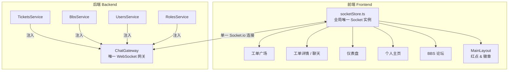
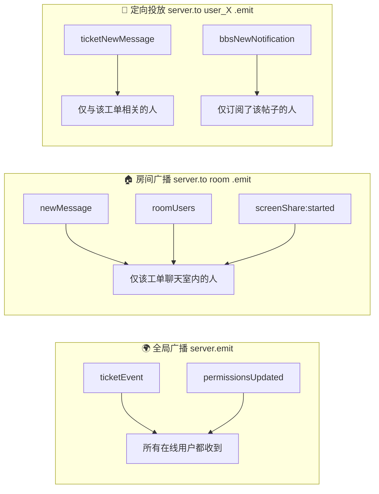

# CallCenter 系统 WebSocket 架构说明文档

## 1. 架构总览

我们的系统确实采用了**单一全局 WebSocket 连接**的架构。整个前端只维护一条到后端 `/chat` 命名空间的 Socket.io 长连接，所有实时通信功能都复用这条连接。



> [!IMPORTANT]
> **核心原理**：后端只有一个 `ChatGateway`，它既是 WebSocket 的网关，也充当了全局事件总线。其他所有 Service（工单、BBS、用户、角色）都通过注入 `ChatGateway` 来获取 `server` 实例，然后借用这条通道向前端推送事件。

---

## 2. 为什么新功能"有时"需要手动添加 WebSocket 事件？

您的疑问非常合理。虽然我们用的是全局 Socket，但它并**不能自动让所有数据都实时更新**。原因是：

### WebSocket 是"事件驱动"的，不是"数据同步引擎"

WebSocket 的本质是一条双向消息管道。它只负责**传递你明确发出的事件**，而不会自动感知数据库里发生了什么变化。

打个比方：

| 类比 | 说明 |
|:---|:---|
| **WebSocket** | 像一部公司内线电话📞，全公司人共用一条热线 |
| **事件 (Event)** | 像电话里的一句话："张三刚接了一个新工单" |
| **数据库变更** | 像一份纸质文件被放进了档案柜📁 |

**电话不会自动告诉你档案柜里多了一份文件**——除非有人拿起电话主动通知你。

所以，每当后端发生了一个需要前端实时感知的"变化"，我们就必须：
1. 在后端代码里写一行 `this.server.emit('事件名', 数据)` → 主动"打电话通知"
2. 在前端代码里写一行 `socket.on('事件名', 处理函数)` → 主动"接电话并做出反应"

---

## 3. 当前系统所有 WebSocket 事件清单

### 3.1 后端 → 前端（服务器推送事件）

| 事件名 | 触发时机 | 广播范围 | 前端监听位置 |
|:---|:---|:---|:---|
| `ticketEvent` | 工单创建/更新/接单/关单/删除/屏幕共享变更 | 🌍 全局广播 | socketStore、工单广场、仪表盘、个人主页、MainLayout、工单详情 |
| `ticketNewMessage` | 工单内有新聊天消息 | 🎯 定向投放（仅参与者） | socketStore |
| `ticketReadCleared` | 某端上报已读 | 🎯 定向投放（同一用户） | socketStore |
| `newMessage` | 聊天消息到达 | 🏠 房间内广播 | 工单详情页 |
| `messageHistory` | 用户加入房间 | 🙋 仅请求者 | 工单详情页 |
| `messageRecalled` | 消息被撤回 | 🏠 房间内广播 | 工单详情页 |
| `roomUsers` | 房间在线人员变更 | 🏠 房间内广播 | 聊天头部组件 |
| `roomLockChanged` | 房间锁定/解锁 | 🏠 房间内广播 | 工单详情页 |
| `screenShare:started` | 有人开始屏幕共享 | 🏠 房间内广播 | useScreenShare Hook |
| `screenShare:stopped` | 屏幕共享停止 | 🏠 房间内广播 | useScreenShare Hook |
| `screenShare:active` | 新用户加入已有共享的房间 | 🙋 仅请求者 | useScreenShare Hook |
| `screenShare:offer/answer/ice` | WebRTC 信令协商 | 🎯 点对点转发 | useScreenShare Hook |
| `voice:peerJoined` | 有人加入语音通话 | 🏠 房间内广播 | useVoiceChat Hook |
| `voice:peerLeft` | 有人离开语音通话 | 🏠 房间内广播 | useVoiceChat Hook |
| `voice:active` | 新用户加入已有通话的房间 | 🙋 仅请求者 | useVoiceChat Hook |
| `voice:offer/answer/ice` | 语音 WebRTC 信令 | 🎯 点对点转发 | useVoiceChat Hook |
| `bbsNewNotification` | BBS 帖子有新回复 | 🎯 定向投放（订阅者） | socketStore |
| `bbsBadeRead` | BBS 未读被清除 | 🎯 定向投放（同一用户） | socketStore |
| `permissionsUpdated` | 管理员修改了角色权限 | 🌍 全局广播 | socketStore |
| `userTyping` | 有人正在输入 | 🏠 房间内广播 | 聊天输入组件 |

### 3.2 前端 → 后端（客户端发送事件）

| 事件名 | 用途 |
|:---|:---|
| `joinRoom` | 加入工单聊天室 |
| `leaveRoom` | 离开工单聊天室 |
| `sendMessage` | 发送聊天消息 |
| `typing` | 通知正在输入 |
| `recallMessage` | 撤回消息 |
| `lockRoom` / `unlockRoom` | 锁定/解锁房间 |
| `kickUser` | 踢出用户 |
| `fetchMoreHistory` | 拉取更多历史消息 |
| `screenShare:start/stop` | 开始/停止屏幕共享 |
| `screenShare:offer/answer/ice/requestView` | 屏幕共享 WebRTC 信令 |
| `voice:join/leave` | 加入/离开语音通话 |
| `voice:offer/answer/ice` | 语音 WebRTC 信令 |

---

## 4. 三种广播范围详解

我们的 WebSocket 事件并不是"一股脑全发给所有人"，而是精心设计了三种不同的广播范围：



| 范围 | 代码写法 | 使用场景 |
|:---|:---|:---|
| **全局广播** | `this.server.emit(...)` | 所有人都需要知道的事（工单状态变更、权限变更） |
| **房间广播** | `this.server.to('ticket_123').emit(...)` | 仅影响当前在这个工单聊天室里的人 |
| **定向投放** | `this.server.to('user_456').emit(...)` | 仅通知特定的某个用户（如红点推送） |

> [!TIP]
> 定向投放是通过 `user_{userId}` 这个个人房间实现的。每个用户在 WebSocket 连接建立时就自动加入了自己的个人房间（[chat.gateway.ts:88](file:///Users/yipang/Documents/code/callcenter/backend/src/modules/chat/chat.gateway.ts#L88)），因此后端随时可以给特定用户精准推送消息。

---

## 5. "ticketEvent" — 系统核心枢纽事件

`ticketEvent` 是系统中最重要的全局事件，它是唯一一个被 **6 个前端组件同时监听** 的事件：

| 前端位置 | 监听到 ticketEvent 后的行为 |
|:---|:---|
| [socketStore.ts](file:///Users/yipang/Documents/code/callcenter/frontend/src/stores/socketStore.ts#L297) | 更新红点徽章、播放提示音、更新 myTicketIds |
| [MainLayout.tsx](file:///Users/yipang/Documents/code/callcenter/frontend/src/components/MainLayout.tsx#L89) | 刷新 myTicketIds（用于侧边栏红点计算） |
| [Tickets/index.tsx](file:///Users/yipang/Documents/code/callcenter/frontend/src/pages/Tickets/index.tsx#L207) | **重新调用 API 拉取工单列表**（工单广场刷新） |
| [TicketDetail.tsx](file:///Users/yipang/Documents/code/callcenter/frontend/src/pages/Tickets/TicketDetail.tsx#L310) | 刷新工单详情和标签列表 |
| [Dashboard/index.tsx](file:///Users/yipang/Documents/code/callcenter/frontend/src/pages/Dashboard/index.tsx#L93) | 刷新仪表盘统计数据 |
| [Profile/index.tsx](file:///Users/yipang/Documents/code/callcenter/frontend/src/pages/Profile/index.tsx#L67) | 刷新个人主页的工单列表 |

> [!WARNING]
> **关键认知**：`ticketEvent` 的前端监听方式大多是**收到通知后重新调用 HTTP API 拉取最新数据**（Pull 模式），而不是直接从事件 payload 里拿数据来用（Push 模式）。这是因为工单列表数据量大、带分页、带筛选，不适合在 WebSocket 事件里全量推送。

---

## 6. 回答您的核心问题：为什么新功能需要单独加 WebSocket？

以这次的"屏幕共享状态"为例，分析为什么它不能"自动"工作：

### 屏幕共享状态的数据流

```
用户A 点击"共享屏幕"
    ↓
前端 emit('screenShare:start')
    ↓
后端 ChatGateway 收到，记录到内存 Map (activeSharers)
    ↓
❌ 这个状态没有写进数据库！
❌ 工单的 REST API 查不到这个状态！
❌ ticketEvent 之前也不会为此触发！
    ↓
所以工单广场根本不知道有人在共享屏幕
```

**问题根源**：屏幕共享状态是一个**纯内存中的瞬时状态**（存在 `ChatGateway.activeSharers` 这个 Map 里），它不是数据库字段。当工单广场通过 HTTP API 拉取工单列表时，后端原本不会去查这个内存 Map。

**我们为此做了两件事**：
1. 在后端 `findAll` 返回工单列表时，追加查询 `chatGateway.hasActiveScreenShare(ticketId)` → 让 HTTP API 能返回共享状态
2. 在 `screenShare:start/stop` 事件处理函数里追加 `this.server.emit('ticketEvent')` → 让工单广场实时感知共享状态变化

---

## 7. 哪些功能是"自动实时"的，哪些不是？

| 功能 | 是否自动实时 | 原因 |
|:---|:---|:---|
| 新工单创建 | ✅ 自动 | `TicketsService.create()` 会调用 `broadcastTicketEvent('created')` |
| 工单接单/关单 | ✅ 自动 | 相应的 Service 方法里已内置 `broadcastTicketEvent()` |
| 工单被删除 | ✅ 自动 | 同上 |
| 聊天新消息 | ✅ 自动 | `ChatGateway.handleSendMessage()` 已内置房间广播 |
| 红点/徽章 | ✅ 自动 | socketStore 统一处理 `ticketNewMessage` 和 `ticketEvent` |
| BBS 新回复 | ✅ 自动 | `BbsService` 里已调用 `chatGateway.server.to()` |
| 权限变更 | ✅ 自动 | `UsersService` 和 `RolesService` 已内置全局广播 |
| 屏幕共享状态在广场显示 | ❌ 需手动添加 | 状态在内存中，API 查不到 + 无全局通知 |
| 某个自定义的新统计字段 | ❌ 需手动添加 | 后端 API 返回值需要扩展 + 可能需要触发刷新 |

> [!NOTE]
> **规律总结**：凡是通过 `TicketsService` 的标准增删改操作修改数据库的功能，都已经内置了 `broadcastTicketEvent()` 全局广播，**自动实时**。但如果是一些**不经过数据库**、或者是**新增的维度信息**（如屏幕共享这种纯内存状态），就需要手动在对应位置补发事件。

---

## 8. 架构优劣分析

### ✅ 当前架构的优点

1. **极致简单**：全系统只有一条 WebSocket 连接、一个 Gateway，维护成本极低
2. **天然复用**：所有业务模块（工单、BBS、权限）都通过注入同一个 Gateway 来推送事件，不存在多个独立 WebSocket 服务器的协调问题
3. **带宽友好**：只建一条连接，不会像某些系统那样每个功能模块都建一条独立的 WebSocket
4. **扩展方便**：新增一个实时功能只需要在后端加一个 `emit()`、前端加一个 `on()`

### ⚠️ 潜在的改进空间

1. **ticketEvent 过于"万能"**：目前很多页面监听到 ticketEvent 后无差别地调用 `loadTickets()`。如果事件频率很高（比如100个人同时在线操作），会导致大量冗余 API 调用。可以考虑在前端加防抖，或者根据 `event.action` 做精细化过滤。
2. **"Pull after Push" 模式**：目前工单广场的刷新模式是"收到 ticketEvent → 重新调 HTTP API 拉数据"，理论上可以优化为直接在事件里携带差量数据，减少一次 HTTP 往返。但考虑到分页和筛选的复杂性，当前模式其实是最稳妥的选择。
3. **内存状态同步**：像 `activeSharers` 这种纯内存状态，如果未来部署多实例（集群），需要引入 Redis Adapter 来同步多节点的内存状态。

---

## 9. 文件索引

| 文件 | 职责 |
|:---|:---|
| [chat.gateway.ts](file:///Users/yipang/Documents/code/callcenter/backend/src/modules/chat/chat.gateway.ts) | 后端唯一的 WebSocket 网关，处理所有实时事件 |
| [socketStore.ts](file:///Users/yipang/Documents/code/callcenter/frontend/src/stores/socketStore.ts) | 前端全局 Socket 状态管理，统一管理连接、红点、徽章 |
| [tickets.service.ts](file:///Users/yipang/Documents/code/callcenter/backend/src/modules/tickets/tickets.service.ts) | 工单业务逻辑，内置 `broadcastTicketEvent` 全局广播 |
| [bbs.service.ts](file:///Users/yipang/Documents/code/callcenter/backend/src/modules/bbs/bbs.service.ts) | BBS 业务逻辑，定向推送帖子通知 |
| [users.service.ts](file:///Users/yipang/Documents/code/callcenter/backend/src/modules/users/users.service.ts) | 用户管理，权限变更时全局广播 |
