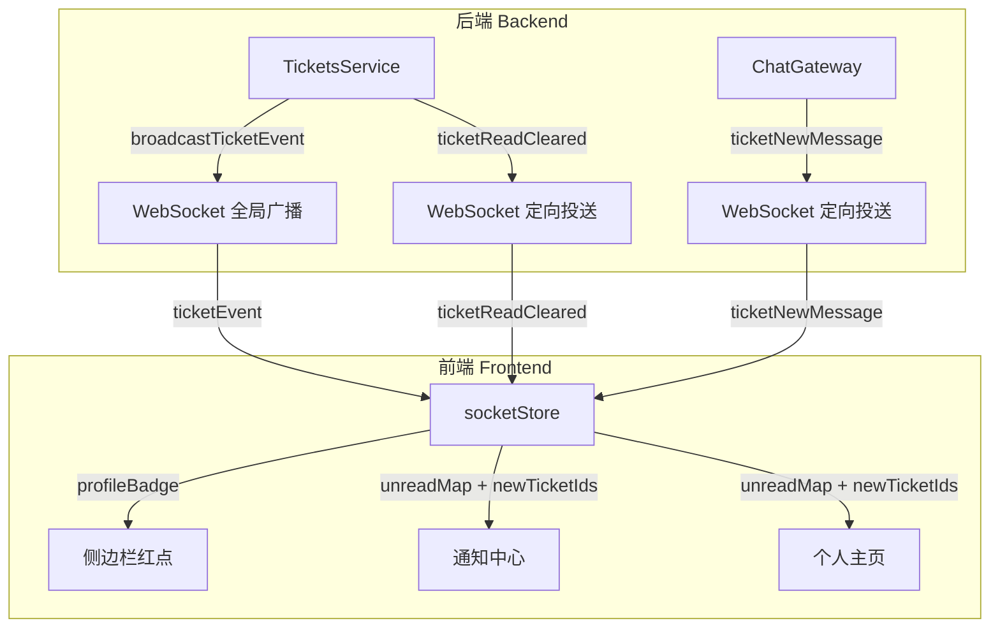
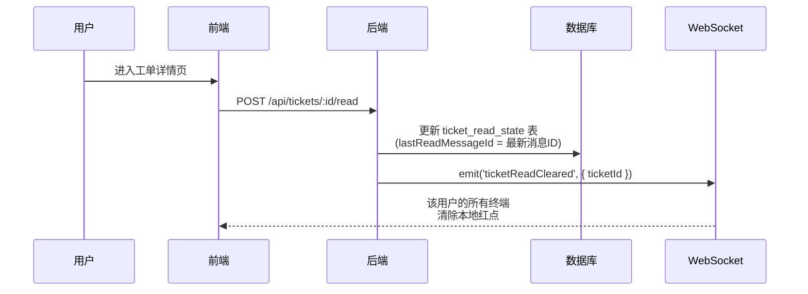

# CallCenter 通知系统逻辑说明文档

> 版本：v2.0（2026-04-24 整改后）
> 适用范围：工单生命周期通知、聊天消息未读提醒、通知中心展示、个人主页红点

---

## 一、系统架构概览



### 三种 WebSocket 事件

| 事件名 | 用途 | 广播方式 | 携带数据 |
|--------|------|---------|---------|
| `ticketEvent` | 工单生命周期变化（创建/接单/关单/删除等） | **全局广播**（所有在线用户） | `{ action, operatorId, data: { 工单完整信息 } }` |
| `ticketNewMessage` | 有人在工单聊天中发送了新消息 | **定向投送**（仅工单相关用户） | `{ ticketId, messageId, senderId, messageType }` |
| `ticketReadCleared` | 某用户已读了某工单 | **定向投送**（仅该用户的所有终端） | `{ ticketId }` |

---

## 二、工单事件（ticketEvent）详解

### 2.1 所有 action 类型

| action | 触发操作 | 谁触发 | 什么时候触发 |
|--------|---------|--------|------------|
| `created` | 新建工单 | 创建者 | 用户提交新工单表单时 |
| `assigned` | 接单 | 接单人 | 用户在工单广场或个人主页点击「接单」按钮时 |
| `updated` | 编辑工单 | 创建者/有编辑权限的人 | 修改工单标题、描述、分类等字段时 |
| `participantAdded` | 邀请专家 | 接单人/创建者 | 在工单详情页邀请专家加入协作时 |
| `participantRemoved` | 移除专家 | 管理员/接单人/创建者 | 在工单详情页将某位专家移出时 |
| `requestClose` | 申请关单 | 接单人 | 接单人认为问题已解决，点击「申请关单」时 |
| `closed` | 确认关单 | 创建者 | 创建者确认问题已解决，点击「确认关单」时 |
| `deleted` | 删除工单 | 创建者/管理员 | 删除单个或批量删除工单时 |

### 2.2 事件携带的数据结构

每个 `ticketEvent` 事件包含以下字段：

```typescript
{
  action: string,        // 事件类型（见上表）
  operatorId: number,    // 触发此操作的用户 ID
  data: {
    id: number,          // 工单 ID
    ticketNo: string,    // 工单编号（如 TK-MO2G88YQ-8662）
    title: string,       // 工单标题
    status: string,      // 工单状态（pending/in_progress/closing/closed）
    creatorId: number,   // 创建者 ID
    assigneeId: number,  // 接单人 ID
    creator: { id, username, displayName, realName },   // 创建者信息
    assignee: { id, username, displayName, realName },  // 接单人信息
    participants: [{ id, username, displayName, realName }],  // 参与专家列表
    // ...其他工单字段
  }
}
```

---

## 三、通知触发规则（谁会收到什么通知）

### 3.1 核心原则

> [!IMPORTANT]
> 1. **自己触发的操作，自己不会收到通知**（通过 `operatorId` 过滤）
> 2. **自己创建的工单，不会标记为"新到达"**
> 3. **只有以下三种 action 会产生「新到达」红点**：`created`、`assigned`、`participantAdded`
> 4. 其他 action（`updated`、`participantRemoved`、`requestClose`、`closed`）只更新工单状态，不产生红点

### 3.2 各场景通知矩阵

#### 场景 1：新建工单（指定接单人）

| 角色 | 收到通知？ | 通知内容 | 说明 |
|------|----------|---------|------|
| 创建者（用户 A） | ❌ 不收到 | — | 自己创建的，`operatorId` = 自己 |
| 指定接单人（用户 B） | ✅ 收到 | 🔔 「新到达」红点 | 通知中心显示工单标题 + 「新到达」标签 |
| 其他用户 | ❌ 不收到 | — | 与工单无关 |

#### 场景 2：新建工单（不指定接单人，发布到广场）

| 角色 | 收到通知？ | 通知内容 | 说明 |
|------|----------|---------|------|
| 创建者（用户 A） | ❌ 不收到 | — | 自己创建的 |
| 所有用户 | ❌ 不收到 | — | 无指定接单人，无人需要通知 |

> 工单广场会通过 `ticketEvent` 自动刷新列表显示新工单。

#### 场景 3：用户接单

| 角色 | 收到通知？ | 通知内容 | 说明 |
|------|----------|---------|------|
| 接单人（用户 B） | ❌ 不收到 | — | 自己主动接单，`operatorId` = 自己 |
| 创建者（用户 A） | ❌ 不收到 | — | `isMyCreation` = true，不标记 NEW |
| 其他用户 | ❌ 不收到 | — | 与工单无关 |

> 工单广场和仪表盘会自动刷新状态（从"待接单"变为"服务中"）。

#### 场景 4：邀请专家

| 角色 | 收到通知？ | 通知内容 | 说明 |
|------|----------|---------|------|
| 邀请操作者（用户 B） | ❌ 不收到 | — | 自己执行的操作 |
| 被邀请的专家（用户 D） | ✅ 收到 | 🔔 「新到达」红点 | 通知中心显示工单标题 + 「新到达」标签 |
| 创建者（用户 A） | ❌ 不收到 | — | 非 `participantAdded` 目标 |
| 其他专家 | ❌ 不收到 | — | 与此操作无关 |

> 工单详情页的参与者列表会实时更新，聊天窗口会出现系统消息「人员变动: 【xxx】邀请专家【xxx】加入了工单」。

#### 场景 5：移除专家（踢人）

| 角色 | 收到通知？ | 通知内容 | 说明 |
|------|----------|---------|------|
| 操作者（管理员/接单人） | ❌ 不收到 | — | 自己执行的操作 |
| 被移除的专家 | ❌ 不收到红点 | 但会被强制退出房间 | 收到 `kicked` 事件，弹出提示「您已被移除该工单讨论组」 |
| 其他参与者 | ❌ 不收到 | — | `participantRemoved` 不在 NEW 白名单中 |

> 聊天窗口会出现系统消息「人员变动: 【xxx】将专家【xxx】移出了工单」。

#### 场景 6：发送聊天消息

| 角色 | 收到通知？ | 通知内容 | 说明 |
|------|----------|---------|------|
| 消息发送者 | ❌ 不收到 | — | 自己发的消息不计未读 |
| 正在查看此工单的人 | ❌ 不收到 | — | 自动触发已读上报 |
| 不在此工单的相关人员 | ✅ 收到 | 未读消息计数 +1 | 通知中心显示「(N 条未读消息)」|

> 未读计数只统计人工消息（`text` / `file` 类型），不统计系统自动消息。

#### 场景 7：申请关单 / 确认关单

| 角色 | 收到通知？ | 说明 |
|------|----------|------|
| 操作者自己 | ❌ 不收到 | `operatorId` 过滤 |
| 其他人 | ❌ 不收到红点 | `requestClose`、`closed` 不在 NEW 白名单中 |

> 工单状态会实时变更（服务中 → 待确认 → 已关闭），相关页面自动刷新。

#### 场景 8：删除工单

| 角色 | 收到通知？ | 说明 |
|------|----------|------|
| 所有用户 | ❌ 不收到红点 | 但本地会自动清理该工单的所有残留状态（未读计数、NEW 标记等） |

> 工单从广场和个人主页中消失。

---

## 四、红点与角标计算规则

### 4.1 profileBadge（侧边栏总红点）

```
profileBadge = 工单未读消息总数 + 新到达工单数 + 论坛未读数
```

其中：
- **工单未读消息总数** = 所有"我的工单"中未读消息的总和（`unreadMap` 中值的累加）
- **新到达工单数** = `newTicketIds` 数组的长度
- **论坛未读数** = 所有订阅帖子的未读评论总和

> 仅统计"与我相关的工单"（我创建的 + 我接手的 + 我参与的）。

### 4.2 通知中心展示

通知中心的下拉列表展示两类条目：

| 类型 | 来源 | 展示内容 | 附加标签 |
|------|------|---------|---------|
| 工单通知 | `unreadMap` + `newTicketIds` | 工单标题 + 工单号 | 有新到达标记时显示绿色「新到达」标签 |
| 论坛通知 | `bbsUnreadMap` | 帖子标题 | 显示「交流互动」+ 未读条数 |

点击通知条目会：
1. 关闭通知面板
2. 清除该工单的 NEW 标记和未读计数
3. 跳转到对应的工单详情页或帖子页

### 4.3 个人主页标签页角标

每个标签页（我申请的 / 我接手的 / 我参与的）上方显示角标数字：

```
标签页角标 = 该标签页下工单的未读消息总数 + 新到达工单数
```

- 角标为红色：包含新到达的工单
- 角标为蓝色：仅有未读消息（无新到达工单）

### 4.4 工单卡片角标

每张工单卡片上最多可以同时显示两种角标：

| 角标 | 位置 | 样式 | 含义 |
|------|------|------|------|
| **NEW** | 卡片右上角 | 红底白字，带脉冲动画 | 这是一张新分配/新邀请的工单，用户尚未查看 |
| **未读计数** | 工单号右侧 | 蓝色消息图标 + 数字气泡 | 该工单有 N 条新的聊天消息未阅读 |

**清除时机**：
- NEW 标记：用户点击卡片进入工单详情后清除
- 未读计数：用户进入工单详情后自动上报已读，清除本地和远端红点

---

## 五、已读状态同步机制

### 5.1 已读上报流程



### 5.2 多端同步

当用户在**手机端**查看了某工单：
1. 手机端上报已读 → 后端更新数据库
2. 后端向该用户的**所有在线终端**发送 `ticketReadCleared`
3. **电脑端**收到事件 → 自动清除该工单的未读计数和 NEW 标记
4. 无需手动刷新，红点实时消失

---

## 六、声音与视觉提醒

### 6.1 提示音

| 场景 | 音效 | 触发条件 |
|------|------|---------|
| 新聊天消息 | 🔔 短促「叮」声 (880Hz → 1320Hz) | 收到 `ticketNewMessage` 且不在该工单页面 |
| 新到达工单 | 🔔🔔 双响「嘟嘟」声 (523Hz → 784Hz, 523Hz → 1047Hz) | `newTicketIds` 长度增加 |

> 音效使用 Web Audio API 合成，无需外部音频文件。浏览器未交互前会静默跳过。

### 6.2 标签页标题闪烁

当 `profileBadge > 0` 时，浏览器标签页标题会在以下两个状态间每秒切换：

```
🔴 (3条新消息) CallCenter - 技术支持系统
CallCenter - 技术支持系统
```

用户切回页面且无未读时，标题恢复正常。

---

## 七、边界情况与注意事项

### 7.1 老数据兼容

> [!NOTE]
> 系统升级前已存在的工单可能没有 `ticket_read_state` 记录。对于这些工单：
> - 如果工单创建时间超过 24 小时，**不会标记为 NEW**（避免满屏红点）
> - 未读计数从 0 开始，不追溯历史消息

### 7.2 外部链接用户

通过外部分享链接（`/external/ticket/xxx`）进入的用户：
- 使用临时 JWT Token（7 天有效期）
- 可以查看和发送消息
- **不参与**通知系统的红点计算
- 其消息的 `senderId` 为 null

### 7.3 管理员特权

管理员（`role: admin`）可以：
- 移除任何工单的参与者（普通用户只能移除自己创建/接手的工单的参与者）
- 删除任何工单（普通用户只能删除自己创建的）

但管理员的通知规则与普通用户完全一致 — 自己的操作不产生自我通知。

### 7.4 WebSocket 断线重连

- 客户端使用 `reconnection: true`，无限重连
- 重连成功后自动拉取一次全量状态（`getMyBadges` API），确保红点数据准确
- 如果断开原因是 Token 过期（`io server disconnect`），会自动刷新 Token 后重连

---

## 八、数据流速查表

### 用户操作 → 触发事件 → 前端响应

| 用户操作 | 后端事件 | 前端 socketStore 响应 | UI 变化 |
|---------|---------|---------------------|---------|
| 新建工单（指定接单人） | `ticketEvent: created` | 接单人 newTicketIds +1 | 接单人看到「新到达」红点 |
| 新建工单（广场） | `ticketEvent: created` | 无人标记 NEW | 广场列表刷新 |
| 接单 | `ticketEvent: assigned` | 接单人自己不标记 | 广场/仪表盘状态刷新 |
| 编辑工单 | `ticketEvent: updated` | 不标记 NEW | 工单详情实时更新 |
| 邀请专家 | `ticketEvent: participantAdded` | 被邀者 newTicketIds +1 | 被邀者看到「新到达」红点 |
| 踢人 | `ticketEvent: participantRemoved` | 不标记 NEW | 被踢者强制退出，系统消息 |
| 申请关单 | `ticketEvent: requestClose` | 不标记 NEW | 状态变为「待确认」 |
| 确认关单 | `ticketEvent: closed` | 不标记 NEW | 状态变为「已关闭」 |
| 删除工单 | `ticketEvent: deleted` | 清理本地残留 | 工单从列表消失 |
| 发送消息 | `ticketNewMessage` | 不在此工单的相关人 unread +1 | 红点 + 叮声 |
| 查看工单 | `ticketReadCleared` | 清除该工单 unread | 红点消失（全终端同步） |

---

## 九、常见问题 FAQ

**Q: 为什么我做了操作后没有收到通知？**
A: 系统设计为「自己触发的操作，自己不收到通知」。这是为了避免干扰。

**Q: 为什么切换到"我接手的"标签后，红点消失了但卡片上没看到 NEW？**
A: 旧版本有此问题，已修复。现在切换标签不会自动清除 NEW 标记，您可以看到哪些卡片标有红色 NEW 角标，点击进入后才会消除。

**Q: 红点数字不准确怎么办？**
A: 刷新页面即可。系统会在页面加载和 WebSocket 重连时重新拉取一次准确的红点数据。

**Q: 外部用户发的消息会不会触发通知？**
A: 会。外部用户发的消息同样会向工单的创建者、接单人和参与者推送未读提醒。

**Q: 为什么踢人后聊天窗口有系统消息，但没有红点？**
A: 系统消息（类型为 `system`）是在工单聊天房间内广播的 (`newMessage`)，不通过全局 `ticketNewMessage` 事件推送红点，因此不会累加未读数。这是有意设计，避免操作型系统消息干扰未读计数。
