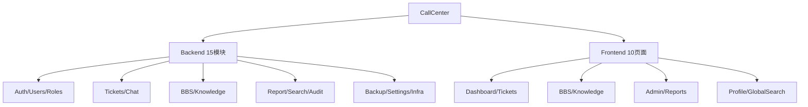

# CallCenter 项目代码质量审计报告

> 审计日期：2026-04-23 | 审计范围：全栈代码（Backend + Frontend）

---

## 一、项目概览

### 技术栈
| 层级 | 技术 | 版本 |
|------|------|------|
| 后端框架 | NestJS + TypeORM | - |
| 数据库 | MySQL (utf8mb4) | - |
| 搜索引擎 | Elasticsearch | - |
| 前端框架 | React + Vite | - |
| UI 组件库 | Ant Design | - |
| 状态管理 | Zustand | - |
| 实时通信 | Socket.IO + WebRTC | - |

### 代码规模
| 区域 | 文件数 | 代码行数 |
|------|--------|----------|
| 后端 (backend/src) | ~40 | ~7,800 |
| 前端 (frontend/src) | ~45 | ~12,700 |
| **总计** | **~85** | **~20,500** |

### 模块分布


---

## 二、架构评价

### ✅ 做得好的方面

1. **模块化清晰** — 后端 15 个独立模块，职责分明，符合 NestJS 最佳实践
2. **权限体系完善** — RBAC 模型 + `@Permissions()` 装饰器 + Guard 链 (`AuthGuard → RolesGuard → PermissionsGuard`)
3. **实时通信设计优秀** — Socket.IO 全局单例 + Zustand 状态同步 + 多端未读计数
4. **WebRTC 屏幕共享** — P2P 架构 + 服务端活跃状态跟踪 + 随时加入/退出
5. **全局异常处理** — `GlobalExceptionFilter` 统一响应格式
6. **Token 自动续期** — 前端拦截器 401 → 刷新 → 重试，Socket 断线重连
7. **审计日志** — 关键操作全链路记录

---

## 三、问题发现与整改建议

### 🔴 严重 (Critical) — 必须修复

---

#### C1. 生产环境使用 `synchronize: true`

[app.module.ts](file:///Users/yipang/Documents/code/callcenter/backend/src/app.module.ts#L53)

```typescript
synchronize: true, // 开发阶段自动同步表结构
```

> [!CAUTION]
> `synchronize: true` 在生产环境极度危险！TypeORM 会自动修改数据库表结构，可能导致**数据丢失**（如删除列、重建索引）。一次 Entity 的误改就可能摧毁生产数据。

**修复建议**：
```diff
- synchronize: true,
+ synchronize: process.env.NODE_ENV !== 'production',
```
长期方案：引入 TypeORM Migration 管理数据库变更。

---

#### C2. JWT Secret 硬编码在 `.env` 中且强度不足

```
JWT_SECRET=callcenter_jwt_secret_key_2026
JWT_REFRESH_SECRET=callcenter_refresh_secret_key_2026
```

> [!CAUTION]
> Secret 可预测且可能被提交到版本控制。如果泄露，攻击者可以伪造任意用户的 JWT Token。

**修复建议**：
- 使用 `openssl rand -base64 64` 生成随机密钥
- 确保 `.env` 在 `.gitignore` 中
- 生产环境通过环境变量注入，不写入文件

---

#### C3. 零测试覆盖

整个项目没有任何单元测试或集成测试文件。

> [!WARNING]
> 无测试保护意味着每次修改都可能引入回归 Bug，且无法验证权限逻辑的正确性。

**修复建议**（优先级排序）：
1. `PermissionsGuard` — 权限绕过是最高风险
2. `TicketsService.assign/requestClose/confirmClose` — 状态机核心流程
3. `AuthService.login/refreshToken` — 认证链路
4. API 拦截器 401 重试逻辑

---

#### C4. 后端混用 `console.log` 和 NestJS Logger

后端有 **16 处** `console.log/error/warn` 调用，同时部分模块使用 `Logger`。

> [!IMPORTANT]
> `console.log` 无法被 NestJS 日志级别控制，生产环境会输出大量调试信息且无法过滤。

**修复建议**：
统一使用 NestJS `Logger`：
```diff
- console.log(`[屏幕共享] 用户 ${userName} 发起共享`);
+ this.logger.log(`用户 ${userName} 发起共享`, 'ScreenShare');
```

---

#### ~~C5.~~ → 降级为 M11（见中等优先级）

> 载荷限制因业务需要（BBS 长图文 + 聊天日志包上传），保留 20MB。已从 Critical 降级。

---

#### C6. 函数内 `require()` 调用

[tickets.service.ts](file:///Users/yipang/Documents/code/callcenter/backend/src/modules/tickets/tickets.service.ts#L543-L545), [chat.service.ts](file:///Users/yipang/Documents/code/callcenter/backend/src/modules/chat/chat.service.ts#L66-L68)

```typescript
const archiver = require('archiver');
const path = require('path');
const fs = require('fs');
```

> [!IMPORTANT]
> 函数内 `require()` 绕过了 TypeScript 类型检查，且每次调用都触发模块解析。应改为顶部 `import`。

---

### 🟠 高 (High) — 强烈建议修复

---

#### H1. TicketDetail.tsx 单文件 1614 行 — 严重的 God Component

[TicketDetail.tsx](file:///Users/yipang/Documents/code/callcenter/frontend/src/pages/Tickets/TicketDetail.tsx) 包含：
- 工单信息展示
- 聊天消息列表 + 输入框
- 文件上传/预览
- 屏幕共享 + 支援模式
- 专家邀请 Modal
- 分享外链生成
- 报告导出
- 知识库生成
- 房间锁定

**修复建议**：拆分为 5-6 个子组件：
| 组件 | 职责 | 估算行数 |
|------|------|----------|
| `TicketInfoCard` | 左侧工单信息展示 | ~150 |
| `ChatMessageList` | 消息列表渲染 | ~200 |
| `ChatInputBar` | 输入框 + 文件上传 | ~150 |
| `ChatHeader` | 在线用户 + 操作按钮 | ~100 |
| `TicketActions` | 接单/关单/删除等操作 | ~100 |
| `TicketDetail` | 主容器 + 状态管理 | ~300 |

---

#### H2. index.css 单文件 1278 行 — 缺乏模块化

所有样式集中在一个文件中，包含全局变量、组件样式、动画、移动端适配等。

**修复建议**：
- 全局变量 → `variables.css`
- 组件样式 → CSS Modules 或组件同目录的 `.css` 文件
- 聊天相关 → `chat.css`
- 支援模式 → `support-mode.css`

---

#### H3. `tickets.service.ts` (1107行) 职责过重

单个 Service 包含：CRUD、状态流转、权限校验、ZIP/DOCX 导出、分享令牌生成。

**修复建议**：
- 导出功能 → `TicketExportService`
- 权限校验逻辑 → 提取为共用 Guard 或工具函数
- 报告生成 → `TicketReportService`

---

#### H4. `batchDelete` 中的 N+1 查询问题

[tickets.service.ts](file:///Users/yipang/Documents/code/callcenter/backend/src/modules/tickets/tickets.service.ts#L367-L401)

```typescript
// 权限检查阶段：逐个查询
for (const id of ids) {
  const ticket = await this.ticketRepository.findOne({ where: { id } });
  // ...
}
// 删除阶段：又逐个查询
for (const id of ids) {
  const ticket = await this.ticketRepository.findOne({ where: { id } });
  // ...
}
```

**修复建议**：使用 `IN` 查询批量获取，避免 2N 次数据库访问。

---

#### H5. 前端 `role` 类型不一致

[authStore.ts](file:///Users/yipang/Documents/code/callcenter/frontend/src/stores/authStore.ts#L11)

```typescript
role: { id: number; name: string; permissions?: any[] } | null | string;
```

`role` 可能是对象也可能是字符串，导致全项目散布着如下防御性代码：
```typescript
const roleName = typeof user.role === 'string' ? user.role : (user.role?.name || '');
```

**修复建议**：后端统一返回 `role` 为对象格式，前端消除 `string` 类型分支。

---

#### H6. Socket.IO 无认证超时处理

[chat.gateway.ts](file:///Users/yipang/Documents/code/callcenter/backend/src/modules/chat/chat.gateway.ts) 的 `handleConnection` 中，如果 JWT 验证失败仅 `disconnect()`，但无 **连接速率限制**。

**修复建议**：
- 添加连接速率限制（如每 IP 每分钟最多 10 次）
- 失败连接加入短暂黑名单

---

#### H7. 前端 `any` 类型滥用

后端有 **215 处** `any` 类型使用。前端关键类型缺失（API 响应、Socket 事件等大量使用 `any`）。

**修复建议**：
- 定义 Socket 事件类型接口 (`TicketNewMessageEvent`, `ScreenShareStartedEvent` 等)
- API 响应使用泛型 `ApiResponse<T>` （已定义但 BBS/Report API 未使用）
- 渐进式替换 `any` → 具体类型

---

#### H8. 敏感操作缺少审计

以下操作未记录审计日志：
- 用户登录/登出
- 权限变更
- 文件上传/下载
- 房间锁定/解锁
- 数据库备份/恢复

---

### 🟡 中 (Medium) — 建议优化

---

#### M1. `socketStore.ts` (506行) 状态和副作用混合

Store 内包含 Web Audio 音效合成、标题闪烁定时器等 UI 副作用。

**建议**：音效/标题闪烁提取为独立 `utils/notification.ts`。

---

#### M2. 外部用户 Token 无法撤销

外部分享链接生成的 JWT Token 有效期 7 天，一旦生成无法提前撤销。

**建议**：添加 Token 黑名单表或使用短期 Token + 刷新机制。

---

#### M3. 文件上传缺乏类型/大小白名单

[files module] 未见文件类型限制和大小限制的全局配置。

**建议**：添加 `allowedMimeTypes` 白名单和 `maxFileSize` 限制。

---

#### M4. WebRTC 无 TURN 服务器

当前仅使用 Google STUN 服务器，在严格 NAT/防火墙环境下无法连接。

**建议**：部署 `coturn` TURN 服务器，作为 WebRTC 的中继备用路径。

---

#### M5. `App.tsx` 中 `import` 语句位置不规范

```typescript
// Line 137 — 在组件函数之间使用 import
import { useThemeStore } from './stores/themeStore';
```

**建议**：将所有 `import` 移到文件顶部。

---

#### M6. 数据库密码为空

`.env` 中 `DB_PASSWORD=` 为空。即使是开发环境也建议设置密码。

---

#### M7. CORS 配置硬编码开发端口

```typescript
const corsOrigins = process.env.CORS_ORIGIN
  ? process.env.CORS_ORIGIN.split(',')
  : ['http://localhost:5173', 'http://localhost:3001'];
```

**建议**：生产环境确保 `CORS_ORIGIN` 已设置，否则 fallback 到开发端口有安全风险。

---

#### M8. 撤回消息时间窗口硬编码

```typescript
if (elapsed > 10 * 60 * 1000) {
  throw new BadRequestException('只能撤回 10 分钟内的消息');
}
```

**建议**：改为通过 `Settings` 表配置。

---

#### M9. `ProtectedRoute` 中直接解析 JWT

[App.tsx](file:///Users/yipang/Documents/code/callcenter/frontend/src/App.tsx#L26-L37) 手动实现 `parseJwt` Base64 解码。

**建议**：使用 `jwt-decode` 库，或在 `authStore.setAuth` 时解析并存储 role。

---

#### M10. 搜索 Subscriber 与 ChatService 同步冲突

[search.subscriber.ts](file:///Users/yipang/Documents/code/callcenter/backend/src/modules/search/search.subscriber.ts#L57-L60) 中 Message 类型被跳过，注释说明由 ChatService 处理。但 Subscriber 仍然注册了所有实体，增加了不必要的运行时开销。

---

#### M11. 载荷限制调整 (50MB → 20MB)

[main.ts](file:///Users/yipang/Documents/code/callcenter/backend/src/main.ts#L21-L22)

```typescript
app.use(express.json({ limit: '50mb' }));
app.use(express.urlencoded({ extended: true, limit: '50mb' }));
```

> [!NOTE]
> 因 BBS 支持长图片帖子（Base64 内嵌）、聊天中上传系统日志包等大文件需求，不宜过度压缩限制。

**修复建议**：
```diff
- app.use(express.json({ limit: '50mb' }));
- app.use(express.urlencoded({ extended: true, limit: '50mb' }));
+ app.use(express.json({ limit: '20mb' }));
+ app.use(express.urlencoded({ extended: true, limit: '20mb' }));
```
- 将当前 50MB 降为 **20MB**，满足业务需求同时减少滥用风险
- 文件上传走 `multipart/form-data`（`multer`），不受 JSON 限制影响
- 后续可考虑 BBS 图片改为先上传获取 URL，进一步降低 JSON Body 大小

---

### 🔵 低 (Low) — 可选改进

---

#### L1. 前端缺少 Error Boundary
无全局 React Error Boundary，运行时渲染错误会白屏。

#### L2. 无 API 版本控制
`/api/tickets` 无版本前缀（如 `/api/v1/tickets`），将来升级 API 时不好兼容。

#### L3. 无 Rate Limiting
REST API 无请求频率限制，可能被恶意刷接口。可使用 `@nestjs/throttler`。

#### L4. 缺少健康检查端点
建议添加 `/api/health` 端点供监控系统使用。

#### L5. 前端无 Loading 骨架屏
页面加载时仅显示 Spin，可优化为 Skeleton 提升感知性能。

---

## 四、优先修复路线图

```mermaid
gantt
    title 修复优先级路线图
    dateFormat  YYYY-MM-DD
    section P0 紧急
    C1 关闭synchronize:true     :crit, c1, 2026-04-23, 1d
    C2 更换JWT Secret          :crit, c2, 2026-04-23, 1d
    section P1 高优
    H5 统一role类型             :h5, after c5, 2d
    H4 修复N+1查询              :h4, after c5, 1d
    C4 统一Logger               :c4, after c5, 2d
    C6 替换require()            :c6, after c4, 1d
    section P2 中期
    H1 拆分TicketDetail         :h1, after h5, 5d
    H3 拆分tickets.service      :h3, after h4, 3d
    C3 添加核心测试              :c3, after h3, 5d
    section P3 长期
    H2 CSS模块化                 :h2, after h1, 3d
    M1-M10 中等优先级            :m, after c3, 10d
```

---

## 五、总体评分

| 维度 | 评分 | 说明 |
|------|------|------|
| **架构设计** | ⭐⭐⭐⭐ | 模块划分清晰，RBAC 完善，实时通信设计优秀 |
| **代码质量** | ⭐⭐⭐ | 功能实现完整，但类型安全和模块化有改进空间 |
| **安全性** | ⭐⭐⭐ | 有基础安全措施，但 JWT Secret、Rate Limit 等需加强 |
| **可维护性** | ⭐⭐⭐ | 核心文件过大，缺乏测试，重构成本随时间增长 |
| **性能** | ⭐⭐⭐⭐ | WebRTC P2P 节省带宽，但有 N+1 查询和大载荷风险 |
| **用户体验** | ⭐⭐⭐⭐⭐ | 功能丰富，音效通知/标题闪烁/支援模式等细节出色 |

> **综合评价**：项目功能完整度很高，UX 打磨细致，架构设计合理。主要改进方向是生产环境安全加固（P0）、代码模块化拆分（P1-P2）、和测试覆盖（P2）。
