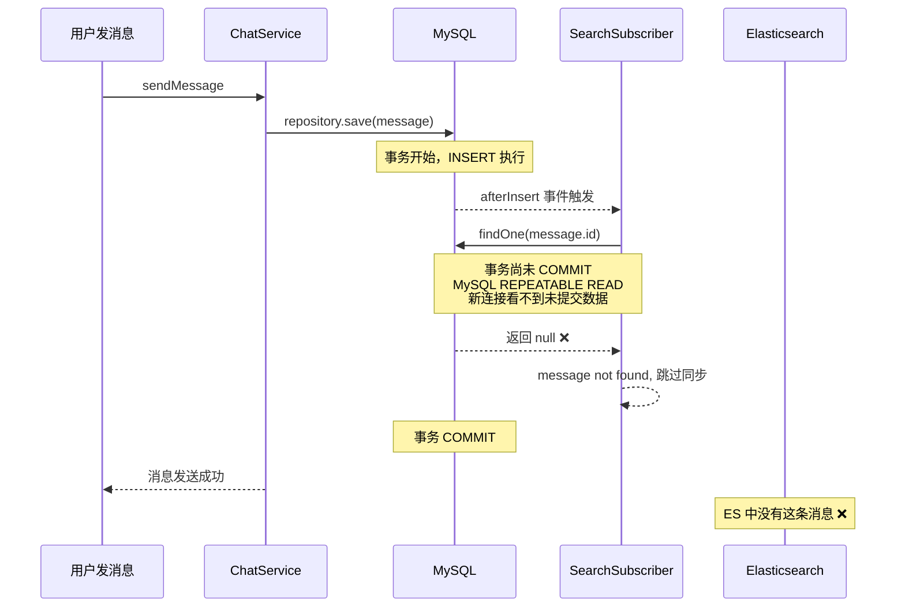

# Elasticsearch 搜索引擎同步机制分析报告（修订版）

---

## 一、核心结论

> [!TIP]
> 修复后，**聊天消息现在可以实时自动同步到 ES**，无需手动点击"全量同步"按钮。日常使用中完全不需要人工干预。

---

## 二、发现并修复的 Bug

### 问题现象
用户在工单聊天中发送消息后，通过全站搜索**搜索不到**该消息。必须到管理后台手动点击"全量同步"按钮后才能搜索到。

### 根因分析

系统原本依赖 TypeORM 的 **Entity Subscriber** 机制来实现实时同步。`SearchSubscriber` 会监听数据库的 `afterInsert` 事件，在数据写入后自动同步到 ES。

但这个机制存在一个**事务隔离级别导致的致命缺陷**：



**关键点**：TypeORM 的 `afterInsert` 回调在**事务提交之前**触发。Subscriber 用一个新的数据库连接去 `findOne` 重新查询实体数据时，由于 MySQL 默认的 `REPEATABLE READ` 事务隔离级别，这个新连接**看不到尚未提交的事务中的数据**，导致返回 `null`，消息就被静默跳过了。

### 修复方案

不再依赖 Subscriber 来同步聊天消息，改为在 `ChatService.createMessage()` 中**直接调用** `SearchService.indexMessage()`：

```typescript
// ChatService.createMessage() 修复后的代码
const saved = await this.messageRepository.save(message);
const fullMessage = await this.messageRepository.findOne({
  where: { id: saved.id },
  relations: ['sender'],
});

// 直接调用 ES 索引，不依赖 Subscriber
if (fullMessage) {
  this.searchService.indexMessage(fullMessage).catch(e => {
    this.logger.warn(`ES sync failed: ${e.message}`);
  });
}
```

此方案有效，因为 `repository.save()` 返回后事务已经提交，`findOne` 能正常读取到完整数据。

---

## 三、各实体的 ES 同步策略现状

| 实体类型 | 同步方式 | 是否可靠 | 说明 |
|---------|---------|---------|------|
| **Post（BBS 帖子）** | ✅ Service 直接调用 | ✅ 可靠 | `BbsService` 中已内置直接调用 `indexPost` |
| **Message（聊天消息）** | ✅ Service 直接调用 | ✅ 可靠（已修复） | `ChatService.createMessage` 中直接调用 `indexMessage` |
| **Ticket（工单）** | ⚠️ Subscriber 回调 | ⚠️ 基本可靠 | 工单操作通过 REST API 处理，事务较简单，Subscriber 通常能生效 |
| **KnowledgeDoc（知识库）** | ⚠️ Subscriber 回调 | ⚠️ 基本可靠 | 同上 |

> [!NOTE]
> 工单和知识库仍然依赖 Subscriber。因为它们的写入走的是 HTTP REST 接口（非 WebSocket），TypeORM 的事务处理方式不同，Subscriber 中的 `findOne` 通常能正常查到数据。如果后续发现工单/知识库也有类似的同步丢失问题，可以用同样的"Service 直接调用"方式修复。

---

## 四、"全量同步"按钮的正确使用场景

| 场景 | 说明 |
|------|------|
| 🆕 **首次引入 ES** | ES 空库，需灌入历史数据 |
| 🔄 **ES 索引丢失/重建** | 手动删除索引或 ES 升级后 |
| 🐛 **直接操作数据库** | 绕过后端代码直接用 SQL 改数据 |
| 💥 **ES 宕机恢复后** | 宕机期间的数据需要补同步 |
| 🔧 **历史遗留数据** | 修复前产生的未同步消息 |

---

## 五、修改的文件清单

| 文件 | 改动 |
|------|------|
| [chat.service.ts](file:///Users/yipang/Documents/code/callcenter/backend/src/modules/chat/chat.service.ts) | 注入 SearchService，在 createMessage 中直接调用 indexMessage |
| [chat.module.ts](file:///Users/yipang/Documents/code/callcenter/backend/src/modules/chat/chat.module.ts) | 导入 SearchModule 以提供 SearchService 依赖 |
| [search.subscriber.ts](file:///Users/yipang/Documents/code/callcenter/backend/src/modules/search/search.subscriber.ts) | Message 分支改为跳过（由 ChatService 处理），增加 debug 日志 |
| [search.service.ts](file:///Users/yipang/Documents/code/callcenter/backend/src/modules/search/search.service.ts) | indexMessage 增加详细错误日志 |

---

## 六、当前 ES 环境状态

| 指标 | 值 |
|------|-----|
| ES 版本 | `8.19.14` |
| 客户端版本 | `@elastic/elasticsearch 8.19.1` |
| 运行状态 | ✅ 正常运行 |
| 索引状态 | 🟡 yellow（单节点正常现象） |
| 实时同步 | ✅ 聊天消息已修复，帖子/工单/知识库正常 |
