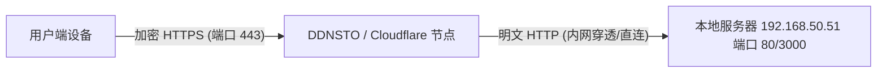

# HTTPS 与内网穿透架构指南

本文档旨在解答关于局域网 HTTPS 改造、证书原理、现有（DDNSTO/Cloudflare）架构合理性，以及未来国内域名部署的疑问。

---

## 一、 局域网改成 HTTPS 是根治的最佳办法吗？

**结论：不是，局域网 IP 直接做 HTTPS 并不是业界推荐的做法。**

很多开发者在遇到局域网掉线等问题时，第一反应是“是不是没加 HTTPS”。但实际上，对于纯局域网 IP（如 `192.168.50.51`），**不配置 HTTPS 才是常态，也是最合理的设计**。原因如下：

### 我们目前具备给 `192.168.50.51` 加 HTTPS 的条件吗？
**不具备（或者说很难做到完美）。**

国际上公认的权威证书颁发机构（CA），**绝对不会**给局域网私有 IP（如 `192.168.x.x`）颁发合法的 HTTPS 证书。
如果你强行给内网加 HTTPS，只能自己伪造一个“自签名证书”。但当你用浏览器访问 `https://192.168.50.51` 时，浏览器会弹出一个巨大的红色警告：“您的连接不是私密连接（不安全）”，你必须手动点击“高级 -> 继续前往”才能打开网页。这不仅体验极差，而且在很多现代浏览器中会导致更严重的兼容性问题。

> [!NOTE]
> 我们之前通过修改后端代码（取消局域网下的 Cookie Secure 强制限制），才是彻底且优雅地根治了局域网掉线的问题，完全不需要为了这个去给局域网强加 HTTPS。

---

## 二、 现有的 DDNSTO 和 Cloudflare 架构需要改 443 吗？

**不需要，现在的架构非常完美。**

您可能会疑惑：既然内网是 HTTP，为什么外网（DDNSTO/Cloudflare）却是 HTTPS 呢？这其实是现代 Web 架构中最标准的设计，叫做 **SSL 卸载 (SSL Offloading)** 或 **反向代理代理终结**。

### 现在的流量走向是怎样的？



1. **外部安全**：用户到 DDNSTO/Cloudflare 节点之间走广域网，这部分流量很容易被截获，所以 **必须使用 HTTPS**。DDNSTO 和 Cloudflare 已经在他们的节点上为您配置好了合法的证书。
2. **内部高效**：DDNSTO 节点到您的服务器 192.168.50.51 之间，是走加密隧道或者是安全的内网环境。因此，让您的本地服务器只处理最简单的 HTTP 请求，不仅配置简单，还能大幅减轻服务器解密 HTTPS 流量的 CPU 压力。

所以，您的本地服务器继续保持现在的 HTTP 端口即可，**千万不要改成 443 强行开启 HTTPS**，否则 DDNSTO 和 Cloudflare 反而可能因为无法识别自签名证书而导致网站无法访问。

---

## 三、 HTTPS 证书到底是怎么回事？（通俗原理解释）

你可以把 **HTTPS 证书** 想象成互联网上的 **“营业执照”**。

*   **HTTP 是什么？** 就像在马路上大声喊话，任何人（黑客、路由器、运营商）都能听见你喊的内容（比如账号密码）。
*   **HTTPS 是什么？** 相当于给喊话内容套上了一个坚不可摧的密码箱。
*   **证书的作用：** 假设你要把密码箱交给“淘宝网”，你怎么证明对面站着的那个人真的是淘宝，而不是骗子？这时候，对面的人就需要掏出一张由**“公安局”（权威 CA 机构，如 Let's Encrypt, DigiCert）**盖章的“营业执照”（SSL 证书）。
*   **浏览器的职责：** Chrome 等浏览器内置了全世界“公安局”的公章。当你访问网站时，浏览器会检查证书：
    1. 颁发机构是不是真的（有没有公章）？
    2. 证书上的名字（域名）和当前的网址匹不匹配？
    3. 证书有没有过期？
    如果全通过，地址栏就会出现一把安全的小锁。

---

## 四、 未来在国内申请新域名，如何部署 HTTPS？

如果您未来打算买一个属于自己的国内域名（比如 `www.mycallcenter.cn`），并且不再依赖 DDNSTO 的子域名，想要实现全套的自主部署，请参考以下标准流程：

### 1. 域名准备与合规（国内特有环节）
*   **购买域名**：在阿里云、腾讯云等服务商购买域名。
*   **ICP 备案**：由于您的服务器在国内（或者想用国内云服务器），国家规定必须进行 ICP 备案（通常需要 1-2 周）。**没有备案的域名，直接解析到国内服务器会被运营商阻断拦截。**

### 2. 申请 HTTPS 证书
国内云厂商都提供非常便捷的证书申请服务，不需要懂复杂的代码：
*   在阿里云/腾讯云的控制台中找到 **“SSL 证书”** 服务。
*   选择 **“申请免费证书”**（一般有效期为 1 年，每年免费续签）。
*   绑定您的域名（如 `callcenter.您的域名.cn`），点击验证。
*   验证通过后，系统会生成证书，您可以选择 **“下载证书 (适用于 Nginx)”**。

### 3. 配置本地服务器 (Nginx 改造)
下载证书压缩包后，你会得到两个文件：
*   公钥文件：`xxxx.pem` （或者是 `.crt`）
*   私钥文件：`xxxx.key`

把这两个文件上传到您的 `192.168.50.51` 服务器上（例如新建一个 `/etc/nginx/cert/` 目录存放）。然后修改 Nginx 配置文件：

```nginx
# 将原来的 80 端口 HTTP 请求，强制跳转到 HTTPS 443 端口
server {
    listen 80;
    server_name callcenter.您的域名.cn;
    return 301 https://$host$request_uri;
}

# 新增 443 端口处理 HTTPS
server {
    listen 443 ssl;
    server_name callcenter.您的域名.cn;

    # 告诉 Nginx 证书放在哪里
    ssl_certificate /etc/nginx/cert/xxxx.pem;
    ssl_certificate_key /etc/nginx/cert/xxxx.key;

    # 后续的反向代理配置保持与现在一致
    location / {
        root /var/www/callcenter/frontend;
        index index.html;
    }
    
    location /api/ {
        proxy_pass http://localhost:3000/;
    }
}
```

### 4. 路由器端口映射（如果是在公司/家庭自建机房）
如果您是在本地宽带自建服务器，需要在光猫或企业级路由器上配置：
*   将外网的 `443` 端口映射到内网 `192.168.50.51` 的 `443` 端口。
*(注意：国内家庭宽带通常封锁了 80 和 443 端口。如果是家庭宽带，您只能映射到外网的其他端口比如 8443，访问时就得带上端口号：`https://您的域名.cn:8443`。)*

### 总结
对于您目前的业务阶段，**保持现有的内网 HTTP + DDNSTO/Cloudflare 提供边缘 HTTPS 保护是最省心、最专业、性能也最好的做法**。完全没必要去折腾局域网的 HTTPS。直到您未来拥有了独立备案域名和公网服务器，再去按照上述步骤配置 Nginx SSL 即可。
