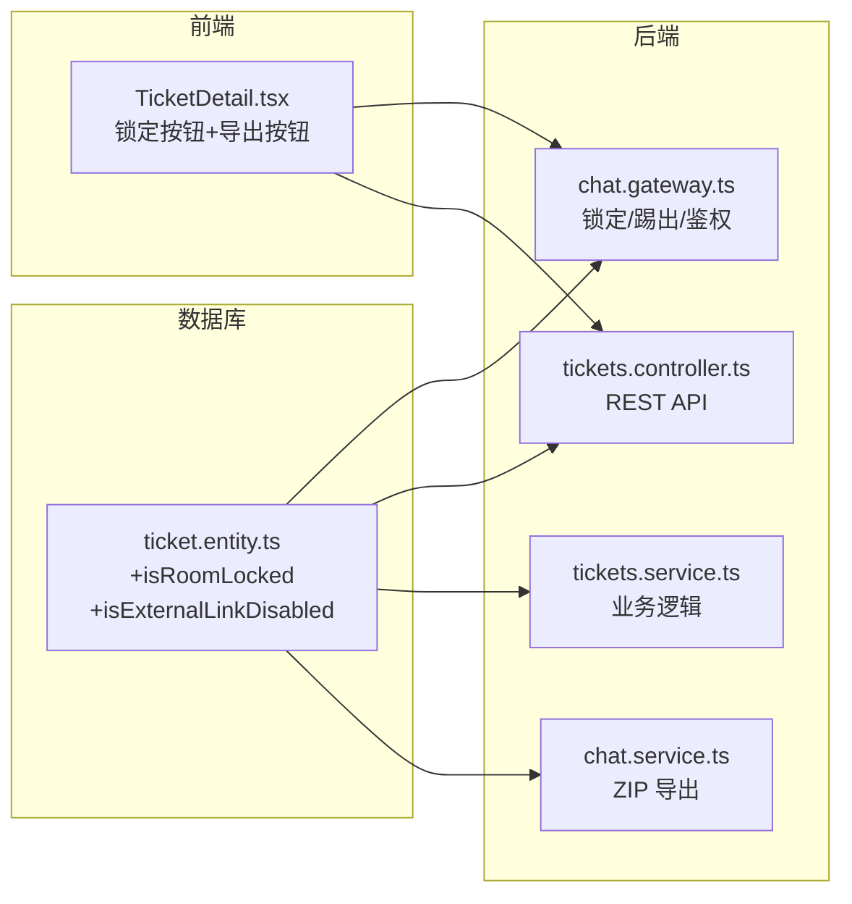
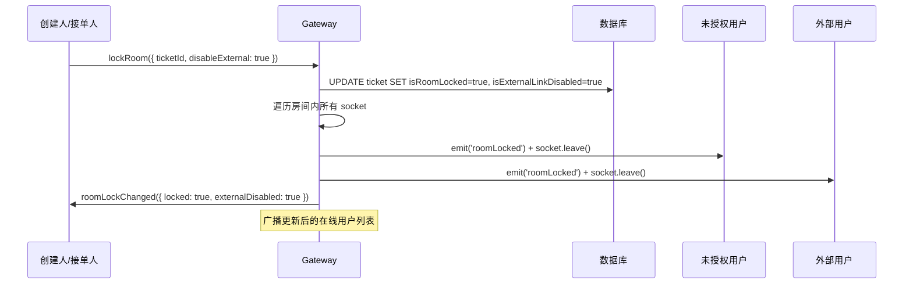
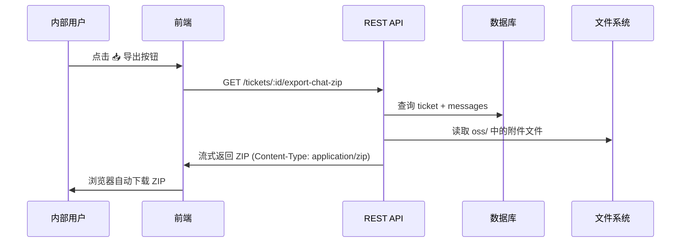

# 工单聊天室锁定 + 一键导出聊天记录 — 实施计划

## 背景与目标

在每个工单的即时沟通界面中增加两大功能：

### 功能 1：房间锁定
- **谁能锁定/解锁**：工单创建人（`creatorId`）和接单人（`assigneeId`）
- **锁定后效果**：非受邀内部人员**立即被踢出**房间，且无法重新进入
- **外链控制**：锁定时可选择是否同时暂停外链访问；解锁后自动恢复外链有效性
- **管理员免锁定**：`admin` 角色始终可进入任何房间

### 功能 2：一键导出聊天记录
- 在聊天界面直接导出带聊天记录和附件的 ZIP 文件
- 无需关单、无需经过知识库
- **权限**：创建人 / 接单人 / participants 可导出；外链用户无权导出

---

## 涉及改动总览



---

## 一、数据库模型变更

### [MODIFY] [ticket.entity.ts](file:///Users/yipang/Documents/code/callcenter/backend/src/entities/ticket.entity.ts)

新增两个字段：

```typescript
@Column({ default: false })
isRoomLocked: boolean;

@Column({ default: false })
isExternalLinkDisabled: boolean;
```

> [!NOTE]
> 项目使用 `synchronize: true`，TypeORM 会自动添加列。两个字段均默认 `false`，对现有数据无影响。

---

## 二、后端 — WebSocket Gateway 改造

### [MODIFY] [chat.gateway.ts](file:///Users/yipang/Documents/code/callcenter/backend/src/modules/chat/chat.gateway.ts)

#### 2.1 `joinRoom` 方法鉴权增强

```
用户发送 joinRoom({ ticketId })
    ↓
查询 ticket (isRoomLocked, isExternalLinkDisabled, creatorId, assigneeId, participants)
    ↓
if (isRoomLocked === true)
    if (用户是 admin) → 放行
    if (用户是 external)
        if (isExternalLinkDisabled) → emit('roomLocked') 并拒绝
        else → 放行（外链用户天然受邀）
    if (用户是 creator 或 assignee) → 放行
    if (用户在 participants 中) → 放行
    else → emit('roomLocked', { message: '房间已锁定...' }) 并拒绝
else
    → 正常 join（现有行为）
```

#### 2.2 新增 `lockRoom` 事件

```typescript
@SubscribeMessage('lockRoom')
async handleLockRoom(client, data: { ticketId, disableExternal: boolean })
```

处理流程：
1. 鉴权：仅 creator / assignee 可操作
2. 更新数据库：`isRoomLocked = true`，`isExternalLinkDisabled = data.disableExternal`
3. **立即踢出未授权用户**：
   - 遍历房间内所有 socket
   - 对每个 socket 检查是否为授权用户（creator / assignee / participant / admin / 允许的 external）
   - 不满足条件 → emit `roomLocked` → 强制 `socket.leave(room)`
4. 广播 `roomLockChanged({ ticketId, locked: true, externalDisabled })` 给剩余用户
5. 广播更新后的在线用户列表

#### 2.3 新增 `unlockRoom` 事件

```typescript
@SubscribeMessage('unlockRoom')
async handleUnlockRoom(client, data: { ticketId })
```

处理流程：
1. 鉴权：仅 creator / assignee 可操作
2. 更新数据库：`isRoomLocked = false`，`isExternalLinkDisabled = false`
3. 广播 `roomLockChanged({ ticketId, locked: false, externalDisabled: false })`

### [MODIFY] [chat.module.ts](file:///Users/yipang/Documents/code/callcenter/backend/src/modules/chat/chat.module.ts)

注入 `Ticket` entity 的 Repository，供 Gateway 查询工单信息。

---

## 三、后端 — REST API 补充

### [MODIFY] [tickets.controller.ts](file:///Users/yipang/Documents/code/callcenter/backend/src/modules/tickets/tickets.controller.ts)

新增两个路由：

#### 3.1 锁定控制

```typescript
@Post(':id/room-lock')
@Permissions('tickets:read')
async toggleRoomLock(@Param('id') id, @Body() body: { locked: boolean, disableExternal?: boolean }, @Req() req)
```

- 仅 creator / assignee 可调用
- 作为 WebSocket 的补充，确保 HTTP 也能操作

#### 3.2 一键导出聊天记录 ZIP

```typescript
@Get(':id/export-chat-zip')
@Permissions('tickets:read')
async exportChatZip(@Param('id') id, @Req() req, @Res() res)
```

- 权限校验：creator / assignee / participant 可导出
- 外部用户（`req.user.role === 'external'`）→ 拒绝
- 直接流式返回 ZIP（复用现有 `archiver` + `oss` 附件提取逻辑）
- **无需关单、无需先写入知识库**

### [MODIFY] [tickets.service.ts](file:///Users/yipang/Documents/code/callcenter/backend/src/modules/tickets/tickets.service.ts)

新增方法：

```typescript
async toggleRoomLock(ticketId, userId, locked, disableExternal): Promise<Ticket>
async exportChatZip(ticketId, userId, res): Promise<void>
```

`exportChatZip` 的实现逻辑：
1. 查询 ticket + messages（含 sender 关联）
2. 生成 Markdown 格式聊天记录
3. 使用 `archiver` 打包：
   - `聊天记录.md` — 文本形式的完整对话
   - `attachments/` — 提取消息中的图片和文件附件
4. 流式返回 ZIP

> [!NOTE]
> 与现有 `knowledge.service.ts` 中的 `exportZip` 不同，这里**不经过知识库**，直接从 ticket + messages 拼装。现有的附件提取逻辑（从 `oss/` 目录读取文件）可以复用。

---

## 四、前端 — TicketDetail 界面

### [MODIFY] [TicketDetail.tsx](file:///Users/yipang/Documents/code/callcenter/frontend/src/pages/Tickets/TicketDetail.tsx)

#### 4.1 新增状态

```typescript
const [isRoomLocked, setIsRoomLocked] = useState(false);
const [isExternalDisabled, setIsExternalDisabled] = useState(false);
```

#### 4.2 聊天头部 — 锁定按钮

在 `.chat-header` 在线头像组的右侧添加：

```
[🔓] ← 点击弹出确认框（含"是否同时暂停外链"选项）→ 发送 lockRoom
[🔒] ← 已锁定状态，点击解锁 → 发送 unlockRoom
```

- 仅当 `user.id === ticket.creatorId || user.id === ticket.assigneeId` 时显示
- 锁定状态下显示 🔒 + 红色锁标识
- 使用 antd `Popconfirm` / `Modal` 弹出锁定选项

#### 4.3 聊天头部 — 导出按钮

在锁定按钮旁边添加 📥 导出按钮：

```
[📥 导出] ← 点击直接触发浏览器下载 ZIP
```

- 调用 `GET /api/tickets/:id/export-chat-zip`，设置 `responseType: 'blob'`
- 通过 `URL.createObjectURL` + `<a>` 标签触发浏览器下载
- **仅内部受邀用户显示**：`creator / assignee / participant`
- 外部用户（`role === 'external'`）不显示此按钮

#### 4.4 Socket 事件监听

新增监听：
- `roomLockChanged` → 更新 `isRoomLocked` / `isExternalDisabled` 状态
- `roomLocked` → 被踢出时显示提示："该房间已锁定，仅受邀人员可参与"，聊天区域替换为空状态页

#### 4.5 被踢出的 UI 效果

当收到 `roomLocked` 事件时：
- 聊天消息区域替换为一个居中的锁定提示卡片
- 输入框禁用
- 提示："🔒 该房间已被锁定，如需参与请联系工单创建人或接单人邀请您加入"

---

## 五、权限矩阵总览

### 房间锁定权限

| 用户类型 | 未锁定 | 锁定 + 外链开放 | 锁定 + 外链暂停 |
|---|:---:|:---:|:---:|
| **创建人** | ✅ 进入 · 可锁定 | ✅ 进入 · 可解锁 | ✅ 进入 · 可解锁 |
| **接单人** | ✅ 进入 · 可锁定 | ✅ 进入 · 可解锁 | ✅ 进入 · 可解锁 |
| **participants** | ✅ 进入 | ✅ 进入 | ✅ 进入 |
| **admin** | ✅ 进入 | ✅ 进入 | ✅ 进入 |
| **外部用户** | ✅ 进入 | ✅ 进入 | ❌ 被拒/踢出 |
| **其他内部人员** | ✅ 进入 | ❌ 被拒/踢出 | ❌ 被拒/踢出 |

### 导出权限

| 用户类型 | 可导出 |
|---|:---:|
| **创建人** | ✅ |
| **接单人** | ✅ |
| **participants** | ✅ |
| **admin** | ✅ |
| **外部用户** | ❌ |
| **其他内部人员** | ✅（如果未被锁门在外） |

---

## 六、数据流

### 锁定 + 踢出流程



### 一键导出流程



---

## 七、验证计划

### 构建验证
- `cd backend && npm run build` — 确保无编译错误
- `cd frontend && npm run build` — 确保无 TypeScript 错误

### 功能验证

| # | 测试场景 | 预期结果 |
|---|---|---|
| 1 | 创建人锁定房间（不禁用外链） | ✅ 未授权内部用户被立即踢出，外部用户不受影响 |
| 2 | 创建人锁定房间（禁用外链） | ✅ 未授权内部用户 + 外部用户均被踢出 |
| 3 | 被踢出用户尝试重新进入 | ❌ 收到 roomLocked 提示，无法进入 |
| 4 | participant 在锁定后进入 | ✅ 正常进入 |
| 5 | admin 在锁定后进入 | ✅ 正常进入 |
| 6 | 接单人解锁房间 | ✅ 锁定状态清除，外链恢复，所有人可进入 |
| 7 | 刷新页面后锁定状态持久化 | ✅ 从数据库加载 isRoomLocked |
| 8 | 内部用户点击导出 | ✅ 浏览器下载 ZIP |
| 9 | 外部用户尝试导出 | ❌ 按钮不可见 / 接口返回 403 |
| 10 | ZIP 内容校验 | ✅ 包含聊天记录.md + attachments/ 文件夹 |

---

## 八、工时预估

| 模块 | 预估时间 |
|---|---|
| 数据库 Entity 变更 | 5 分钟 |
| 后端 Gateway 锁定/踢出/鉴权 | 25 分钟 |
| 后端 REST API（锁定 + 导出） | 20 分钟 |
| 前端 锁定按钮 + Socket 事件 + 被踢 UI | 25 分钟 |
| 前端 导出按钮 + 下载逻辑 | 10 分钟 |
| 部署 + 验证 | 15 分钟 |
| **合计** | **约 100 分钟** |
