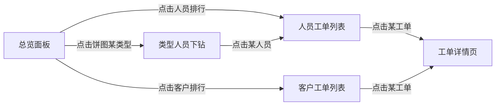

# 报表统计功能实现计划

为系统新增独立的「📊 数据报表」模块，提供多维度、多时间跨度的工单统计与交互式下钻分析能力。

## 核心设计理念

**链式下钻导航**：所有统计数据均可逐级钻取，形成闭环体验：
```
总览面板 → 按类型钻入 → 查看该类型的人员分布 → 点击人员查看工单列表 → 点击工单跳转详情页
```

**纯聚合查询**：不创建新的实体/表，所有统计数据通过对 `tickets` 表 + `ticket_participants` 关联表的 SQL 聚合查询实时生成。

---

## Proposed Changes

### 后端 - 报表 API

#### [NEW] `backend/src/modules/report/report.module.ts`
注册 Report 模块（导入 Ticket 和 User 实体仓库）。

#### [NEW] `backend/src/modules/report/report.service.ts`
核心聚合查询服务，所有方法均接受 `startDate` + `endDate` 时间范围参数：

| 方法 | 功能 | SQL 聚合逻辑 |
|------|------|-------------|
| `getSummary()` | 总览面板数据 | COUNT by status, AVG(closedAt - createdAt) 平均处理时长 |
| `getByType()` | 按工单类型统计 | GROUP BY type |
| `getByPerson()` | 按人员统计 | 分别 GROUP BY creatorId / assigneeId / participants |
| `getByCustomer()` | 按客户统计 | GROUP BY customerName |
| `getTimeSeries()` | 时间趋势 | GROUP BY DATE(createdAt)，按日/周/月粒度 |
| `drillByTypePerson(type)` | 类型→人员下钻 | WHERE type=?, GROUP BY assigneeId |
| `drillPersonTickets(userId, role)` | 人员→工单列表 | WHERE creatorId/assigneeId=userId |

#### [NEW] `backend/src/modules/report/report.controller.ts`
所有端点使用 `@Permissions('report:read')` 守卫。
REST 端点：
- `GET /report/summary` — 总览
- `GET /report/by-type` — 按类型
- `GET /report/by-person` — 按人员
- `GET /report/by-customer` — 按客户
- `GET /report/time-series` — 时间趋势
- `GET /report/drill/type-person?type=xxx` — 类型→人员下钻
- `GET /report/drill/person-tickets?userId=xxx&role=xxx` — 人员→工单列表

所有端点均支持 `?startDate=&endDate=` 时间范围查询参数。

#### [MODIFY] [app.module.ts](file:///Users/yipang/Documents/code/callcenter/backend/src/app.module.ts)
注册 `ReportModule`。

#### [MODIFY] [role-init.service.ts](file:///Users/yipang/Documents/code/callcenter/backend/src/modules/auth/role-init.service.ts)
在 `permissionsToSeed` 中追加 `{ resource: 'report', action: 'read', description: '查看数据报表' }`。
后端启动后自动 seed 到 `permissions` 表，管理员可在「角色与权限」页面中将此权限灵活分配给需要查看报表的角色。

---

### 前端 - 路由与导航

#### [MODIFY] [App.tsx](file:///Users/yipang/Documents/code/callcenter/frontend/src/App.tsx)
新增路由 `/reports`，使用 `RequirePermission`（权限：`report:read`）。

#### [MODIFY] [MainLayout.tsx](file:///Users/yipang/Documents/code/callcenter/frontend/src/components/MainLayout.tsx)
在「工单广场」和「个人主页」之间插入 `📊 数据报表` 导航项。
仅当用户拥有 `report:read` 权限时才显示该菜单项（与知识库/后台管理同样的权限检查逻辑）。

#### [MODIFY] [api.ts](file:///Users/yipang/Documents/code/callcenter/frontend/src/services/api.ts)
新增 `reportAPI` 对象，对应后端所有报表端点。

---

### 前端 - 报表页面

#### [NEW] `frontend/src/pages/Reports/index.tsx`

报表页面采用**单页多视图 + 面包屑下钻**的交互模式：

**1. 顶部控制栏**
- 时间预设快捷按钮：本月 / 本季度 / 本年度 / 全部
- 自定义时间范围选择器（DateRangePicker）
- 当在下钻模式时，显示面包屑路径可逐级返回

**2. 总览面板**（默认视图）
- 4 张统计卡片：总工单数、已完成、进行中、平均处理时长
- **工单类型分布**（饼图/环形图）— 点击某分类 → 进入该类型的人员下钻
- **工单趋势图**（折线图）— 按日期展示工单创建数量趋势
- **人员工作量排行**（横向柱状图）— 点击某人 → 进入该人员的工单列表
- **客户工单排行**（横向柱状图）— 点击某客户 → 显示该客户的工单列表

**3. 类型→人员下钻**（点击饼图某类型后）
- 面包屑：`总览 / 软件问题`
- 显示处理该类型工单的人员列表及其接单数、创建数、参与数
- 点击某人 → 进入工单列表

**4. 人员→工单列表**（点击某人后）
- 面包屑：`总览 / 软件问题 / 张三`
- Tab 切换：创建的 / 接单的 / 参与的
- 工单列表表格，点击行 → `navigate(/tickets/${id})` 跳转工单详情

> [!IMPORTANT]
> 图表使用纯 CSS + 原生 SVG/HTML 实现，**不引入** echarts 等第三方图表库，避免增加 bundle 体积。使用 Ant Design 的 Progress、Tag、数字统计组件配合 CSS gradient bars 实现直观的可视化效果。

---

## 交互流程示意



---

## 文件清单

| 层级 | 文件 | 操作 |
|------|------|------|
| 后端 | `modules/report/report.module.ts` | NEW |
| 后端 | `modules/report/report.service.ts` | NEW |
| 后端 | `modules/report/report.controller.ts` | NEW |
| 后端 | `app.module.ts` | MODIFY |
| 后端 | `modules/auth/role-init.service.ts` | MODIFY |
| 前端 | `pages/Reports/index.tsx` | NEW |
| 前端 | `services/api.ts` | MODIFY |
| 前端 | `App.tsx` | MODIFY |
| 前端 | `components/MainLayout.tsx` | MODIFY |

---

## 权限设计（已确认）

新增权限码 `report:read`（查看数据报表），通过 RBAC 角色控制：
- **admin / director / tech** 默认可通过「角色与权限」页面勾选授予
- **user（一线工程师）** 默认不可见，管理员可按需开放
- **external** 永远不可见

> [!NOTE]
> **数据量考虑**：当前设计基于实时聚合查询。如果未来工单量达到万级以上，可以考虑增加物化视图或定时预计算缓存，但当前阶段实时查询完全满足需求。

---

## Verification Plan

### Automated Tests
- 后端 `npm run build` 编译通过
- 前端 `npm run build` 编译通过

### Manual Verification
1. 访问报表页面，确认时间预设切换正常
2. 确认总览面板 4 张卡片数据与仪表盘数据一致
3. 确认饼图/柱状图数据与实际工单匹配
4. 执行完整的链式下钻流程：点击类型 → 点击人员 → 点击工单 → 跳转至工单详情
5. 通过面包屑逐级返回，状态保持正确
6. 选择不同时间范围，确认数据动态刷新
