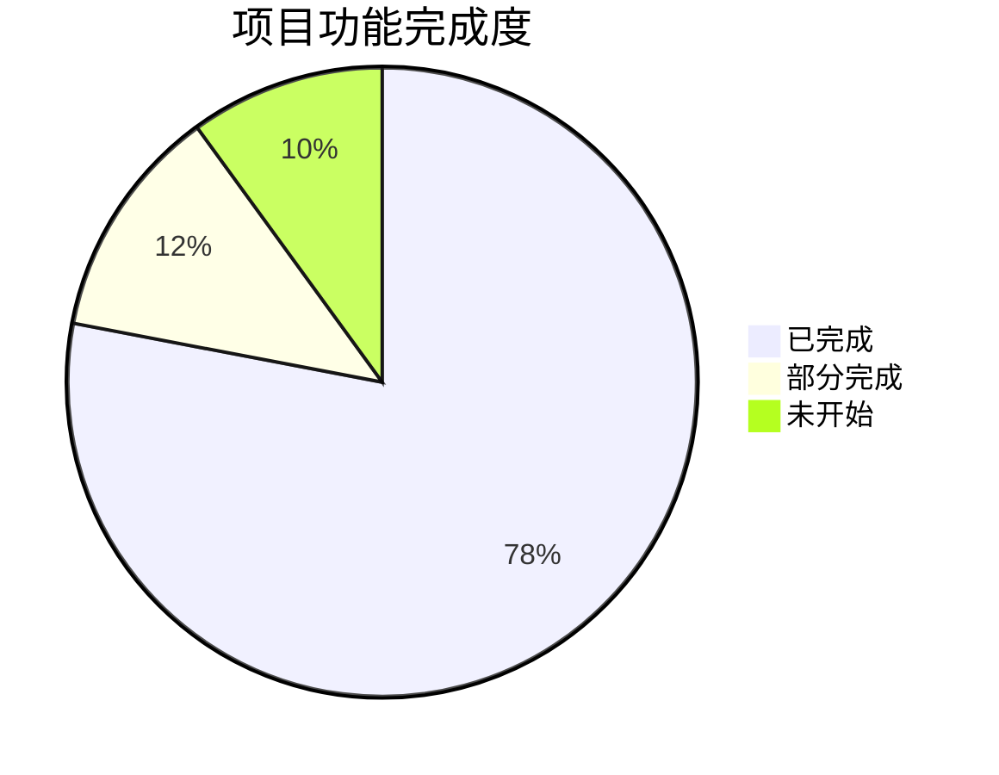
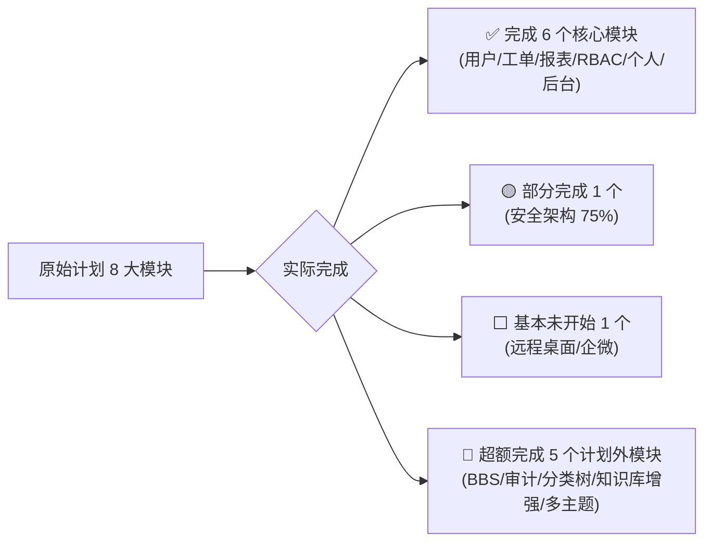

# CallCenter 项目完成度评估报告

## 一、项目概况

基于对 [implementation_plan.md](file:///Users/yipang/Downloads/implementation_plan.md) 原始开发计划和当前代码库的全面分析，本报告对项目完成度进行详细评估。

| 维度 | 计划 | 实际 |
|------|------|------|
| **技术栈** | React 18 + Vite + NestJS + TypeORM + MySQL + Redis | React 19 + Vite 8 + NestJS 11 + TypeORM + MySQL ✅ (Redis 配置已预留) |
| **UI 框架** | Ant Design 5 | Ant Design 5 ✅ |
| **状态管理** | Zustand | Zustand 5 ✅ |
| **实时通讯** | Socket.io | Socket.io 4.8 ✅ |
| **图表引擎** | ECharts | ECharts 6 + echarts-for-react ✅ |
| **富文本/Markdown** | TipTap / react-markdown | @uiw/react-md-editor + react-markdown ✅（方案更优） |

---

## 二、功能模块完成度对照

### 总体评分：⭐⭐⭐⭐☆ （约 78%）

---

### 1. 用户模块 — 完成度 85%

| 计划功能 | 状态 | 说明 |
|---------|------|------|
| 注册/登录 | ✅ 完成 | 用户名+密码注册，默认 admin 管理员自动初始化 |
| JWT 认证 | ✅ 完成 | Access Token + HttpOnly Cookie Refresh Token，自动续期 |
| 用户信息管理 | ✅ 完成 | 修改个人资料、密码修改、管理员密码重置 |
| 用户删除 | ✅ 完成 | 管理员可删除用户 |
| 企业微信对接 | ⬜ 未开始 | 计划中预留 OAuth2，目前未实现 |
| 统一认证 (LDAP/CAS) | ⬜ 未开始 | 计划中预留，目前未实现 |

> [!TIP]
> **超出预期**：实现了**外部访客临时登录系统**（含工单外链和 BBS 外链两套），这是原计划中未详细规划的功能，大幅增强了外部协作能力。

---

### 2. 技术支持/工单模块 — 完成度 85%

| 计划功能 | 状态 | 说明 |
|---------|------|------|
| 工单开单 | ✅ 完成 | 模板化表单，含标题、描述、问题类型、服务单号、客户名称 |
| 工单接单 | ✅ 完成 | 接单后状态流转为"服务中"，生成支持单号 |
| 状态流转 | ✅ 完成 | pending → in_progress → closing → closed 四态完整 |
| 外部访问链接 | ✅ 完成 | 生成外部分享 Token，外部人员可通过链接接入 |
| 工单列表 | ✅ 完成 | 支持分页、筛选(状态/类型/关键词/分类)、Dashboard 模式 |
| 工单详情 | ✅ 完成 | 59KB 的大组件，功能极丰富 |
| 工单删除 | ✅ 完成 | 含单删和批量删除 |
| 工单编辑 | ✅ 完成 | 创建人或具有 `tickets:edit` 权限者可编辑 |
| 即时聊天 | ✅ 完成 | 基于 Socket.io 的实时双向通讯，完整房间机制 |
| 消息类型 | ✅ 完成 | text / image / file / system 四种消息类型 |
| 消息撤回 | ✅ 完成 | 支持撤回自己发送的消息 |
| 聊天记录导出 | ✅ 完成 | 导出为 ZIP 包 |
| 房间锁定 | ✅ 完成 | 仅创建人/接单人可锁定，控制外部用户准入 |
| 邀请参与者 | ✅ 完成 | 邀请其他内部用户加入工单 |
| 正在输入提示 | ✅ 完成 | typing 实时广播 |
| 房间在线列表 | ✅ 完成 | 实时广播房间内在线用户 |
| 关单确认流程 | ✅ 完成 | 接单人申请关单 → 创建人确认 |
| 富文本聊天 | 🟡 部分 | 使用 Markdown 编辑器而非所见即所得编辑器 |
| 远程桌面协助 | ⬜ 未开始 | WebRTC 屏幕共享 / 远程控制均未实现 |
| 2天自动关单 | 🟡 部分 | ScheduleModule 已引入，但自动关单定时任务代码未确认实现 |
| 卡片/列表双模式 | 🟡 部分 | 有列表模式，卡片模式未确认 |

> [!TIP]
> **超出预期**：
> - 三级分类体系 (category1/2/3: 支持类型→技术方向→品牌)，支持 Excel 导入
> - 工单参与者多对多机制（participants），比原计划的创建人/接单人双人模式更灵活
> - 聊天历史分页加载 (fetchMoreHistory)
> - 未读消息追踪系统（全局 Socket 监听 + Badge 计算）

---

### 3. 报表模块 — 完成度 95%

| 计划功能 | 状态 | 说明 |
|---------|------|------|
| 问题类型分布 | ✅ 完成 | by-category API，支持三级钻取 |
| 技术方向分布 | ✅ 完成 | by-category2 / by-category3 API |
| 客户名称统计 | ✅ 完成 | by-customer API + 钻取到工单列表 |
| 接单人统计 | ✅ 完成 | by-person API + 钻取到工单列表 |
| 总数与时长趋势 | ✅ 完成 | summary + time-series API（支持日/月/季/年维度） |
| 交叉矩阵 | ✅ 完成 | cross-matrix API（人员×分类复合分析） |

> [!TIP]
> **超出预期**：
> - 多级钻取功能 (drill/person-tickets, drill/customer-tickets)
> - 日期范围筛选贯穿所有报表
> - 交叉矩阵分析（原计划未提及）
> - 时间维度支持日/月/季/年四种粒度

---

### 4. RBAC 权限模块 — 完成度 90%

| 计划功能 | 状态 | 说明 |
|---------|------|------|
| 角色管理 | ✅ 完成 | admin/director/tech/user/external 五种角色 |
| 权限分配 | ✅ 完成 | 19 项细粒度权限，涵盖 tickets/knowledge/admin/report/settings/bbs |
| 鉴权中间件 | ✅ 完成 | RolesGuard + PermissionsGuard 双重守卫 |
| 权限实时推送 | ✅ 完成 | Socket 推送 permissionsUpdated 事件 |
| 前端权限组件 | ✅ 完成 | RequirePermission + RequireRole 组件 |
| 企业微信用户角色分配 | ⬜ 未开始 | 企业微信未对接 |

> [!TIP]
> **超出预期**：
> - 权限变更实时推送到前端，无需刷新页面
> - 权限装饰器 `@Permissions()` 声明式使用

---

### 5. 个人主页模块 — 完成度 90%

| 计划功能 | 状态 | 说明 |
|---------|------|------|
| 我发起的工单 | ✅ 完成 | my/created API |
| 我接手的工单 | ✅ 完成 | my/assigned API |
| 聊天历史查看 | ✅ 完成 | 从个人页点击进入工单详情 |
| 知识库文档查看 | ✅ 完成 | Knowledge 页面独立 |
| 参与的工单 | ✅ 完成 | my/participated API（**超出原计划**） |

> [!TIP]
> **超出预期**：增加了"我参与的工单"维度，Profile 页有独立的未读 Badge 系统。

---

### 6. 全文搜索 — 完成度 90%

| 计划功能 | 状态 | 说明 |
|---------|------|------|
| MySQL FULLTEXT | ✅ 完成 | KnowledgeDoc 实体已加 ngram 全文索引 |
| Elasticsearch | ✅ 完成 | 四个索引（posts/tickets/messages/knowledge），IK 分词器 |
| 全局搜索页面 | ✅ 完成 | GlobalSearch 前端页面 |
| 全量同步 | ✅ 完成 | syncAll() 一键同步全部数据到 ES |
| 实时增量同步 | ✅ 完成 | search.subscriber.ts 订阅数据变更自动索引 |

> [!IMPORTANT]
> **远超预期**：原计划初期只做 MySQL FULLTEXT，但实际已完成 **Elasticsearch 全套方案**，包含 IK 中文分词、高亮、聚合、多索引搜索、实时增量同步。这是计划中标注为"后续升级"的功能。

---

### 7. 后台管理模块 — 完成度 95%

| 计划功能 | 状态 | 说明 |
|---------|------|------|
| 企业信息配置 | ✅ 完成 | 公司名、电话、邮箱、网站 URL |
| Logo 上传 | ✅ 完成 | 文件上传 + 静态服务 |
| 角色权限可视化配置 | ✅ 完成 | RoleManageTab 组件 |
| AI 配置面板 | ✅ 完成 | Vision 模型 + Image 模型 + API Key + System Prompt |
| 用户管理 | ✅ 完成 | UserManageTab 含角色分配/密码重置/删除 |
| 审计日志 | ✅ 完成 | AuditLogTab 组件（**超出原计划**） |
| 分类管理 | ✅ 完成 | CategoryTab 工单分类 Excel 导入（**超出原计划**） |
| BBS 管理 | ✅ 完成 | BbsManageTab 板块/标签管理（**超出原计划**） |
| 安全设置 | ✅ 完成 | 分享链接过期时间配置（**超出原计划**） |

---

### 8. 安全架构 — 完成度 75%

| 计划措施 | 状态 | 说明 |
|---------|------|------|
| JWT + Cookie | ✅ 完成 | 15m Access + 7d HttpOnly Refresh Token |
| 密码哈希 | ✅ 完成 | bcryptjs |
| CORS | ✅ 完成 | 白名单配置 |
| 全局验证管道 | ✅ 完成 | ValidationPipe + whitelist + transform |
| 审计日志 | ✅ 完成 | 登录/外部登录/工单状态变更审计 |
| HTTPS/SSL | ⬜ 未完成 | Nginx 部署但 SSL 未配置 |
| Rate Limiting | ⬜ 未完成 | 未实现请求频率限制 |
| XSS/CSRF 防护 | 🟡 部分 | Cookie SameSite=lax，但无显式 CSRF Token |

---

## 三、计划外超额完成的功能模块

### 🌟 BBS 技术论坛（完全超出原计划）

原始开发计划中**完全没有 BBS 论坛模块**，但实际实现了一套完整的社区系统：

| 功能 | 实现情况 |
|------|----------|
| 帖子 CRUD | ✅ 创建/编辑/删除/批量删除 |
| 板块管理 | ✅ 板块 CRUD + 帖子迁移 |
| 标签系统 | ✅ 预设标签 + 自由标签 |
| Markdown 编辑器 | ✅ 实时预览 + 大纲目录 |
| 评论系统 | ✅ 评论 CRUD |
| 置顶/归档 | ✅ 管理员操作 |
| 浏览量统计 | ✅ 自动递增 |
| 外部分享链接 | ✅ 匿名访客免密浏览 |
| 权限控制 | ✅ bbs:read/create/edit/delete/comment 五项权限 |

> 这是一个约 **80KB 前端 + 15KB 后端**的完整功能模块，显著提升了系统的团队知识沉淀能力。

### 🌟 审计日志系统（超出原计划）

- 用户登录/失败审计 + IP 记录
- 外部用户接入审计
- 工单状态变更审计
- 日志查询/删除/设置面板

### 🌟 工单分类树体系（超出原计划）

- 三级分类：支持类型 → 技术方向 → 品牌
- Excel 批量导入分类数据
- 前端级联选择器联动

### 🌟 知识库增强功能（超出原计划）

- AI 自动生成知识库文档（Google Gemini API 集成）
- 聊天记录一键导出为知识库文档
- 知识文档导出为 Markdown / DOCX / ZIP
- 知识库全文搜索（MySQL FULLTEXT + Elasticsearch）

### 🌟 多主题系统（超出原计划）

- Dark 暗黑主题
- Light 浅色主题  
- TrustFar 企业定制主题
- Ant Design ConfigProvider 动态主题切换

---

## 四、开发分期对照评估

| 分期 | 计划内容 | 实际完成度 | 评价 |
|------|---------|-----------|------|
| **第一期 (核心)** | 注册/登录 + JWT + 工单 CRUD + 基础 IM + 工单列表 | **100%** ✅ | 全部完成并超越 |
| **第二期 (增强)** | RBAC + 文件上传 + 富文本聊天 + 个人主页 | **90%** | 富文本用 Markdown 替代 WYSIWYG |
| **第三期 (智能化)** | AI 知识库 + 全文搜索 + 报表 + 后台管理 | **95%** | 搜索方案远超预期 |
| **第四期 (高级)** | WebRTC 屏幕共享 + 远程控制 + 企业微信 + SSL | **5%** | 基本未开始 |

---

## 五、技术债务与待改进项

> [!WARNING]
> 以下为需要关注的技术债务：

| 项目 | 风险等级 | 说明 |
|------|---------|------|
| Redis 未实际使用 | 🟡 中 | .env 中配置了但代码中 ioredis 未用于 Session/缓存，单机运行无问题但不可水平扩展 |
| guards 目录为空 | 🟢 低 | Guard 实际放在 auth 模块内，空目录可清理 |
| SQLite 残留文件 | 🟢 低 | `callcenter.sqlite` 残留在后端根目录 |
| 多个 test-*.js 文件 | 🟢 低 | 临时调试测试文件未清理 |
| CORS 硬编码 | 🟡 中 | origin 仅写了 localhost:5173 和 3001，生产应动态配置 |
| 自动化测试缺失 | 🔴 高 | 仅有 spec 骨架文件，无实际单元/E2E 测试 |
| TypeORM synchronize: true | 🟡 中 | 生产环境不应自动同步表结构，应使用 migration |

---

## 六、后续开发更新计划建议

### Phase 1 — 稳定化与安全加固（建议 1-2 周）

| 优先级 | 任务 | 说明 |
|--------|------|------|
| P0 | TypeORM Migration 机制 | 关闭 synchronize，使用 migration 管理 schema 变更 |
| P0 | CORS 配置外部化 | 通过环境变量配置允许的 origin |
| P0 | Rate Limiting | 使用 `@nestjs/throttler` 实现 API 限流 |
| P1 | HTTPS/SSL 部署 | Nginx 配置 Let's Encrypt 证书 |
| P1 | Redis 集成 | JWT 黑名单、接口缓存、Socket.io Adapter |
| P1 | 清理技术债务 | 删除 test-*.js、空 guards/、sqlite 残留 |

### Phase 2 — 功能完善（建议 2-3 周）

| 优先级 | 任务 | 说明 |
|--------|------|------|
| P1 | 2天自动关单定时任务 | @nestjs/schedule Cron 实现超时自动关单 |
| P1 | 工单导出 Excel/PDF | 工单列表导出为报表 |
| P2 | 工单卡片视图 | 完善卡片/列表双模式切换 |
| P2 | 富文本聊天编辑器 | 研究 TipTap 或在现有 Markdown 基础上增强 |
| P2 | 消息已读回执 | 标记对方是否已读 |
| P2 | @提及功能 | 聊天中 @某人 并发送通知 |

### Phase 3 — 高级功能（建议 3-4 周）

| 优先级 | 任务 | 说明 |
|--------|------|------|
| P2 | WebRTC 屏幕共享 | 先实现浏览器端屏幕共享（阶段一） |
| P2 | 企业微信 OAuth2 | 对接企业微信 SSO + 用户同步 |
| P3 | 通知系统 | 站内消息 + 邮件通知 + 企业微信推送 |
| P3 | 移动端适配 | 响应式布局优化或单独 H5 版 |
| P3 | Dashboard 增强 | 个人工作台仪表盘，待办事项、工单提醒 |

### Phase 4 — 运维与扩展（持续）

| 优先级 | 任务 | 说明 |
|--------|------|------|
| P2 | 自动化测试 | Jest 单元测试 + Playwright E2E 测试 |
| P2 | CI/CD 流水线 | GitHub Actions / GitLab CI 自动构建部署 |
| P3 | Docker 容器化 | docker-compose 一键部署 MySQL + Redis + ES + App |
| P3 | 日志与监控 | 结构化日志 + Prometheus 指标 |
| P3 | 远程控制 Agent | Electron/Rust 轻量客户端（阶段二） |

---

## 七、总结

| 指标 | 评分 |
|------|------|
| **计划内功能完成度** | 78% |
| **代码质量与架构** | ⭐⭐⭐⭐ 优秀（模块化清晰、TypeScript 全栈、权限体系完整）|
| **超额交付价值** | ⭐⭐⭐⭐⭐ 卓越（BBS + ES 搜索 + 审计 + 多主题等远超原计划）|
| **生产就绪度** | ⭐⭐⭐ 良好（需补齐安全加固和自动化测试）|
| **综合评价** | **项目整体推进健康，核心业务闭环已打通。第一到第三期计划执行率高，第四期高级功能待推进。超额交付的 BBS、Elasticsearch、审计系统等模块显著提升了系统价值。** |
