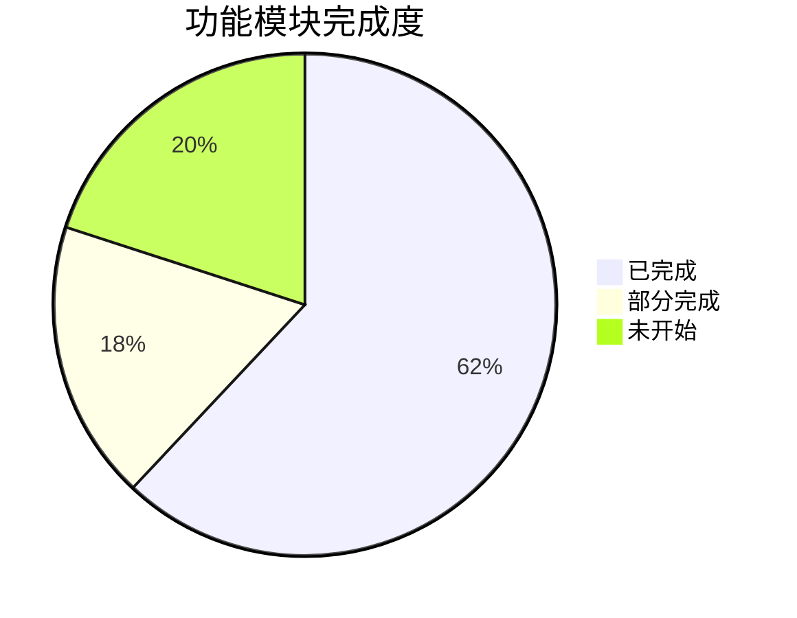

# CallCenter 系统 — 规划 vs 现状 差距分析

## 总体进度概览

| 开发阶段 | 计划内容 | 状态 |
|---------|---------|------|
| **第一期** — 核心功能 | 用户注册/登录 + JWT + 工单 CRUD + 状态流转 + 基础 IM + 工单列表 | ✅ 全部完成 |
| **第二期** — 增强功能 | RBAC 权限 + 文件/图片上传 + 富文本编辑器 + 个人主页 | 🟡 大部分完成 |
| **第三期** — 智能化与报表 | AI 知识库 + 全文搜索 + 统计报表 + 后台管理 | 🟡 部分完成 |
| **第四期** — 高级功能 | WebRTC 屏幕共享 + 远程桌面 Agent + 企微对接 + SSL | ❌ 未开始 |

---

## 逐模块详细对比

### 1. 用户模块

| 规划功能 | 状态 | 说明 |
|---------|------|------|
| 邮箱+密码注册/登录 | ✅ 完成 | `auth` 模块，JWT + HttpOnly Cookie Refresh Token |
| 默认 `admin` 管理员 | ✅ 完成 | `role-init.service.ts` 自动初始化 |
| 企业微信 OAuth2 预留 | ❌ 未开始 | 无 SSO/OAuth2 接口 |
| LDAP/CAS/OIDC 预留 | ❌ 未开始 | 无统一认证协议接口 |

### 2. 技术支持模块

| 规划功能 | 状态 | 说明 |
|---------|------|------|
| 模版化开单表单 | ✅ 完成 | 标题、描述、问题类型、服务单号、客户名称 |
| 接单 + 状态流转 | ✅ 完成 | pending → in_progress → closing → closed |
| 生成工单号 | ✅ 完成 | `TK-` 前缀自动编号 |
| 外部访问短链接 | ✅ 完成 | JWT Token 外链，支持外部人员通过链接加入 |
| Socket.io 实时聊天 | ✅ 完成 | ChatGateway + socketStore，含消息持久化 |
| 图片/文件上传下载 | ✅ 完成 | `files` 模块，OSS 本地存储 |
| **富文本编辑器 (TipTap)** | ❌ 未实现 | 当前使用纯 `<textarea>` + Markdown 渲染，非所见即所得 |
| **远程桌面协助 (WebRTC)** | ❌ 未开始 | 仅有浏览器原生 API 类型定义，无应用代码 |
| 关单流程（申请→确认） | ✅ 完成 | requestClose / confirmClose |
| **2天超时自动关单** | ❌ 未实现 | `ScheduleModule` 已引入但无 Cron Job 编写 |
| AI 关单知识库生成 | ✅ 完成 | Gemini API 集成 |
| 工单列表（卡片+列表） | ✅ 完成 | 双模式切换 |
| 邀请协作专家 | ✅ 完成 | participants 多对多关联 |

### 3. 报表模块

| 规划功能 | 状态 | 说明 |
|---------|------|------|
| 问题类型分布图表 | ❌ 未开始 | 无 ECharts / Chart.js 依赖 |
| 技术方向分布统计 | ❌ 未开始 | 无 reports 后端模块 |
| 客户名称统计 | ❌ 未开始 | — |
| 接单人工作量排名 | ❌ 未开始 | — |
| 总工单数 & 平均处理时长 & 趋势图 | 🟡 有基础 | Dashboard 有统计卡片（总数、待接、服务中等），但无图表 |

> [!WARNING]
> **报表模块是整个规划中差距最大的部分。** 后端缺少 `reports` 聚合查询模块，前端缺少图表库，Dashboard 仅有简单的数字卡片。

### 4. RBAC 权限模块

| 规划功能 | 状态 | 说明 |
|---------|------|------|
| 角色管理（CRUD） | ✅ 完成 | `RoleManageTab` 组件 |
| 权限分配（细粒度） | ✅ 完成 | Permission 实体 + `@Permissions` 装饰器 |
| 鉴权中间件/Guard | ✅ 完成 | JwtStrategy + PermissionsGuard |
| 企微用户角色分配 | ❌ 未开始 | 依赖企微对接 |

### 5. 个人主页模块

| 规划功能 | 状态 | 说明 |
|---------|------|------|
| 我发起的工单列表 | ✅ 完成 | Profile 页面 |
| 我接手的工单列表 | ✅ 完成 | Profile 页面 |
| 查看完整聊天历史 | ✅ 完成 | 点击进入 TicketDetail |
| 查看 AI 知识库文档 | ✅ 完成 | Knowledge 页面 |

### 6. 全文搜索

| 规划功能 | 状态 | 说明 |
|---------|------|------|
| MySQL FULLTEXT + ngram | 🟡 部分完成 | `knowledge_docs` 表已建立全文索引，但 `tickets`/`messages` 表无全文索引 |
| Elasticsearch 升级 | ❌ 未开始 | `.env` 预留了 `ES_NODE` 配置，但无实际代码 |

### 7. 后台管理模块

| 规划功能 | 状态 | 说明 |
|---------|------|------|
| 公司信息配置 | ✅ 完成 | `settings` 模块，含名称、电话、邮箱 |
| Logo 上传 & 品牌定制 | ✅ 完成 | Upload 组件 + 预览 |
| 角色权限可视化配置 | ✅ 完成 | `RoleManageTab` |
| AI 配置面板 | ✅ 完成 | 模型选择 + API Key 配置 |
| **用户管理** | ✅ 完成 | `UserManageTab`（额外实现，计划中未显式列出） |

### 8. 安全架构

| 规划措施 | 状态 | 说明 |
|---------|------|------|
| JWT Access + HttpOnly Refresh | ✅ 完成 | 15min access + 7d refresh |
| Nginx 反向代理 | ✅ 完成 | 通过 Cloudflare Tunnel 代理 |
| **SSL/HTTPS** | 🟡 有基础 | Cloudflare Tunnel 提供 HTTPS，但非自签证书 |
| **Rate Limiting** | ❌ 未实现 | 无 `@nestjs/throttler` 或类似中间件 |
| **CORS 白名单** | 🟡 部分 | WebSocket Gateway 有硬编码 origin，HTTP 层未显式配置 |
| **XSS/CSRF 防护** | ❌ 未实现 | 无 Helmet / CSRF Token |
| 密码 bcrypt 哈希 | ✅ 完成 | |
| API Key AES 加密存储 | ❌ 未实现 | AI API Key 明文存储在 `.env` 和 settings 表 |
| SQL 参数化查询 | ✅ 完成 | TypeORM 自动参数化 |

### 9. Redis 集成

| 规划用途 | 状态 | 说明 |
|---------|------|------|
| WebSocket 会话管理 | ❌ 未使用 | 使用内存 Map 存储在线用户 |
| JWT Token 黑名单 | ❌ 未实现 | 登出未真正失效 Token |
| 消息 Pub/Sub | ❌ 未实现 | 单实例运行，无多节点同步 |
| 接口缓存 | ❌ 未实现 | — |
| Rate Limiting | ❌ 未实现 | — |
| 定时任务锁 | ❌ 未实现 | — |

> [!NOTE]
> `.env` 已预留 `REDIS_HOST` / `REDIS_PORT` 配置，但代码中无任何 Redis 引用。当前单机运行可暂缓。

---

## 额外已实现（计划外）

这些功能超出了原始规划，是后续迭代中增加的：

| 功能 | 说明 |
|------|------|
| 聊天记录导出 (MD + DOCX) | 支持 Markdown 和 Word 格式导出聊天记录 |
| ZIP 一键打包下载 | 聊天记录 + 图片 + 附件统一打包 |
| 知识库分类标签页 | 聊天记录 / AI 知识文档双标签 |
| 文件名规范化 | 工单号_标题 命名格式 |
| 防重复生成 & 智能跳转 | 已有文档自动跳转而非重复生成 |
| 移动端适配 | 响应式布局 + 移动端菜单 |
| WebSocket 自动恢复连接 | Token 过期自动刷新并重连 |
| 工单多标签页切换 | 同时处理多个工单 |
| 外链复制反馈动画 | 3秒图标切换 |

---

## 优先级建议

根据对系统实用性的影响，建议后续开发优先级：

### 🔴 高优先级
1. **报表模块** — 差距最大，对管理决策价值高
2. **2天超时自动关单** — 计划核心功能，`ScheduleModule` 已就位只缺 Cron Job
3. **Rate Limiting** — 基础安全防护，`@nestjs/throttler` 即可实现

### 🟡 中优先级
4. **Redis 集成** — Token 黑名单 + 多实例部署基础
5. **安全加固** — Helmet / CSRF / API Key 加密
6. **工单/消息全文搜索** — 当前仅知识库有全文索引

### 🟢 低优先级（可后续规划）
7. **富文本编辑器 (TipTap)** — 当前 Markdown 方案可用
8. **WebRTC 屏幕共享** — 技术复杂度最高
9. **企业微信/SSO 对接** — 需要企业微信开发者资质
10. **Elasticsearch** — 数据量达到瓶颈后再升级
