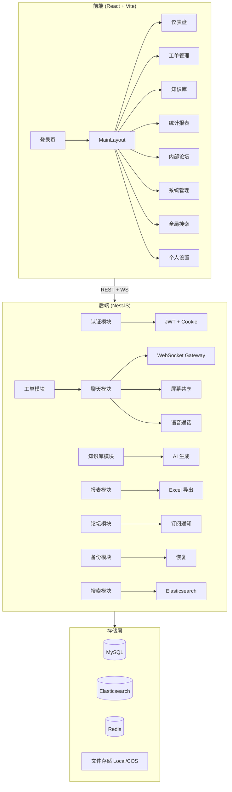
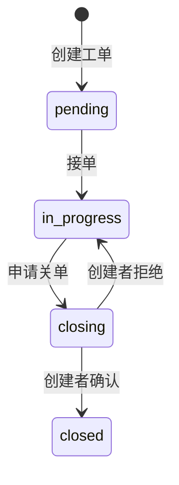
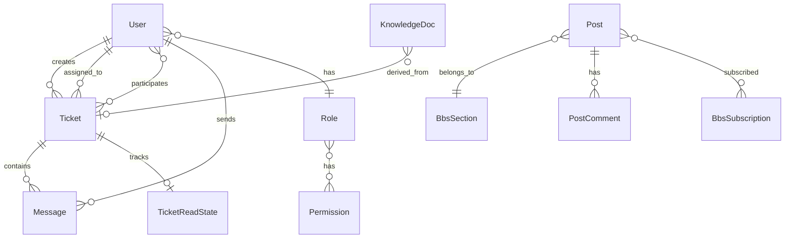
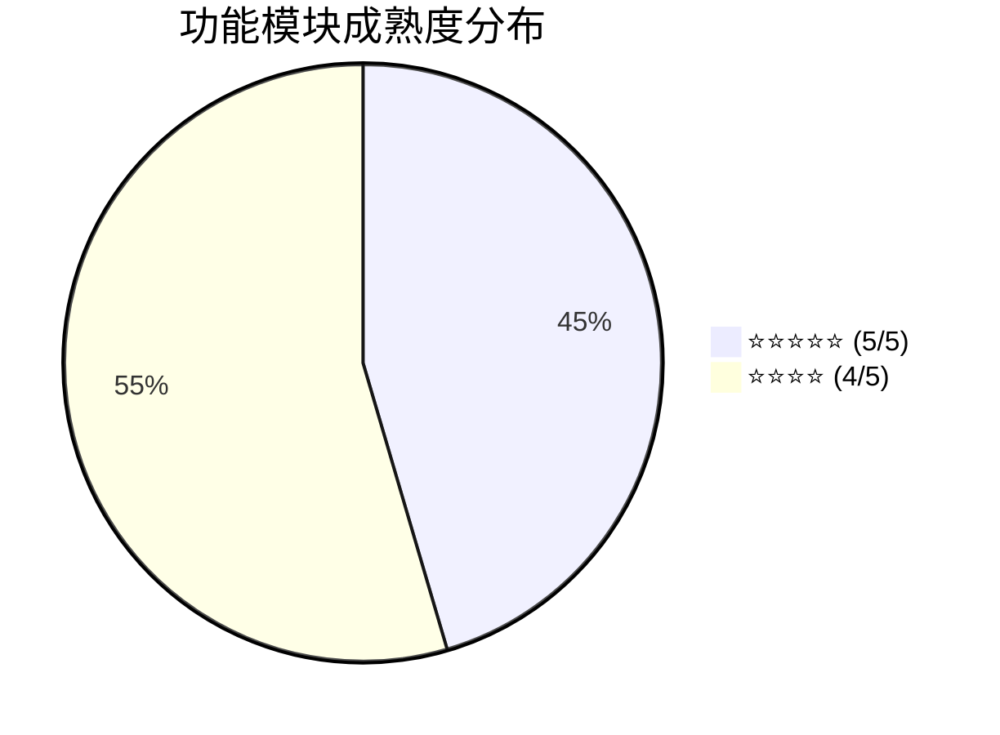

# 客服工单系统 — 功能评估报告

> 评估时间：2026-04-26 | 代码版本：`55ffd2c`

---

## 一、项目概览

| 维度 | 数据 |
|------|------|
| **总代码量** | ~29,400 行 (TS/TSX/CSS) |
| **后端代码** | ~9,600 行 (15 个模块, 16 个实体) |
| **前端代码** | ~14,300 行 (10 个页面, 9 个组件) |
| **技术栈** | NestJS + TypeORM + MySQL + Elasticsearch + Redis + Socket.IO |
| **前端框架** | React + Vite + Ant Design + Zustand |
| **部署方式** | PM2 + Nginx + rsync (本地 + 192.168.50.51 双环境) |

### 系统架构图

---

## 二、功能模块详细评估

### 1. 认证与权限 (Auth)

| 子功能 | 状态 | 说明 |
|--------|:----:|------|
| 用户名/密码登录 | ✅ | bcrypt 加密存储 |
| JWT 双 Token | ✅ | accessToken (内存) + refreshToken (HttpOnly Cookie) |
| 自动刷新 Token | ✅ | 401 拦截器自动续签 |
| RBAC 权限模型 | ✅ | Role → Permission 多对多，细粒度到 `resource:action` |
| 外部用户临时接入 | ✅ | 通过工单分享链接生成临时 JWT，仅限指定工单 |
| BBS 外部分享接入 | ✅ | 论坛帖子外链独立 Token |
| 审计日志 | ✅ | 登录/工单操作/外部接入均有 IP 记录 |

> **权限粒度**：系统支持 `tickets:create`, `tickets:read`, `tickets:edit`, `tickets:delete`, `tickets:assign`, `tickets:share`, `knowledge:*`, `admin:access`, `report:read` 等细粒度权限码，通过 `@Permissions()` 装饰器在控制器层统一拦截。

**成熟度：⭐⭐⭐⭐⭐**

---

### 2. 工单管理 (Tickets)

核心业务模块，代码量最大（后端 1,002 行 Service + 364 行 Controller）。

| 子功能 | 状态 | 说明 |
|--------|:----:|------|
| 工单创建 | ✅ | 自动生成编号 (TK-YYYYMMDD-XXXX)，支持指定处理人 |
| 三级分类体系 | ✅ | category1/2/3，支持 Excel 批量导入 |
| 工单状态机 | ✅ | `pending → in_progress → closing → closed` 四态流转 |
| 接单/申请关单/确认关单 | ✅ | 完整的协作流程，含权限校验 |
| 工单广场 | ✅ | 支持按状态/类型/分类/客户/关键词多维筛选 |
| 聚合统计 | ✅ | 分类、客户、创建人、处理人维度聚合 |
| 批量删除 | ✅ | 级联删除消息+附件+知识库文档 |
| 外部分享 | ✅ | 生成带时效的外链 Token |
| 专家邀请 | ✅ | 邀请/移除工单参与者 (ManyToMany) |
| 房间锁定 | ✅ | 可锁定工单聊天室，禁用外部链接 |
| 未读标记 (Badge) | ✅ | 基于 `TicketReadState` 实体精确追踪每用户已读位置 |
| AI 摘要 | ✅ | 工单级别 AI 内容摘要字段 |
| DOCX 导出 | ✅ | 工单报告导出含图片嵌入 |
| ZIP 导出 | ✅ | 聊天记录+附件打包下载 |

**状态机流转图：**

**成熟度：⭐⭐⭐⭐⭐**

---

### 3. 实时聊天 (Chat)

基于 Socket.IO 的 WebSocket 网关，代码量 811 行。

| 子功能 | 状态 | 说明 |
|--------|:----:|------|
| 实时文字消息 | ✅ | 基于工单房间 (`ticket_{id}`) 的消息收发 |
| 图片/文件消息 | ✅ | 支持 image、file、system 多类型 |
| 消息撤回 | ✅ | 支持撤回已发送消息 |
| 消息复制 | ✅ | 聊天气泡内置复制按钮 |
| 在线状态追踪 | ✅ | RoomService 管理用户在线/房间状态 |
| 多端红点同步 | ✅ | 通过 `user_{id}` 个人房间广播未读通知 |
| 工单事件广播 | ✅ | 创建/更新/关闭等状态变更实时推送 |
| 定向消息投放 | ✅ | 新消息仅推送给工单参与者，避免信息泄露 |
| 屏幕截图 | ✅ | 前端集成截图容器 + 图片编辑器 |
| ES 实时索引 | ✅ | 新消息直接调用 searchService.indexMessage |

**成熟度：⭐⭐⭐⭐⭐**

---

### 4. WebRTC 协作 (Screen Share + Voice)

| 子功能 | 状态 | 说明 |
|--------|:----:|------|
| 屏幕共享 | ✅ | 完整 SDP Offer/Answer/ICE 信令链路 |
| 观看请求 | ✅ | 多端请求观看、分享方授权 |
| 最大观看人数 | ✅ | 可配置 `screenShare_maxViewers` |
| 语音通话 | ✅ | 多人语音通话，Mesh 拓扑 |
| 通话人数上限 | ✅ | 可配置 `voice_maxParticipants` |
| STUN/TURN 配置 | ✅ | 管理面板可配置自定义 ICE 服务器 |

**成熟度：⭐⭐⭐⭐**

---

### 5. 知识库 (Knowledge)

| 子功能 | 状态 | 说明 |
|--------|:----:|------|
| AI 文档生成 | ✅ | 基于工单聊天记录自动生成知识文档草稿 |
| 聊天记录导出 | ✅ | 工单聊天→知识库文档自动转换 |
| Markdown 编辑 | ✅ | 富文本 Markdown 内容存储 |
| 标签/分类/严重度 | ✅ | 多维度文档元数据 |
| 全文搜索 | ✅ | MySQL FULLTEXT + Elasticsearch 双引擎 |
| 导出 MD/DOCX/ZIP | ✅ | 三种格式导出 |
| 分析图/流程图 | ✅ | 支持 analysisImgUrl / flowImgUrl 附图 |

**成熟度：⭐⭐⭐⭐**

---

### 6. 统计报表 (Reports)

后端 617 行 Service，前端 535 行页面。

| 子功能 | 状态 | 说明 |
|--------|:----:|------|
| 工单概览 Dashboard | ✅ | 各状态数量、平均处理时长 |
| 分类统计 (三级钻取) | ✅ | category1 → category2 → category3 逐级下探 |
| 人员统计 | ✅ | 按处理人/创建人维度统计工单量 |
| 客户统计 | ✅ | 按客户名统计总量/已关/活跃 |
| 时间序列 | ✅ | 按日/周/月维度的趋势分析 |
| 交叉矩阵 | ✅ | 分类×人员/客户交叉分析 |
| 钻取详情 | ✅ | 从汇总到具体工单列表的下钻 |
| Excel 导出 | ✅ | 多 Sheet 完整报表导出 |
| 时间范围筛选 | ✅ | 支持自定义日期区间 |

**成熟度：⭐⭐⭐⭐⭐**

---

### 7. 内部论坛 (BBS)

| 子功能 | 状态 | 说明 |
|--------|:----:|------|
| 板块管理 | ✅ | CRUD + 排序、图标 |
| 帖子发布/编辑 | ✅ | 富文本 (longtext)，支持标签、置顶、归档 |
| 评论系统 | ✅ | 帖子评论 CRUD |
| 板块订阅通知 | ✅ | 订阅帖子 → 新评论推送通知 |
| 帖子迁移 | ✅ | 批量将帖子迁移到其他板块 |
| 预设标签 | ✅ | 管理员预配置标签库 |
| 外部分享 | ✅ | 生成只读外链 Token |
| 浏览计数 | ✅ | 帖子阅读量追踪 |
| 批量删除 | ✅ | 级联清理评论+附件 |

**成熟度：⭐⭐⭐⭐**

---

### 8. 全局搜索 (Search)

| 子功能 | 状态 | 说明 |
|--------|:----:|------|
| Elasticsearch 集成 | ✅ | 4 个索引：posts/tickets/messages/knowledge |
| 多字段加权搜索 | ✅ | title^3 > content > aiSummary |
| 搜索高亮 | ✅ | `<em>` 关键词标记 |
| 分类聚合 | ✅ | 按 type / sectionName 聚合 |
| 实时增量索引 | ✅ | TypeORM Subscriber + ChatService 直推双通道 |
| 全量同步 | ✅ | 管理员手动触发全量 ES 重建 |
| IK 分词器 (生产) | ✅ | 生产环境自动切换 `ik_max_word`/`ik_smart` |

**成熟度：⭐⭐⭐⭐**

---

### 9. 文件管理 (Files)

| 子功能 | 状态 | 说明 |
|--------|:----:|------|
| 本地存储 | ✅ | UUID 文件名，`/oss` 目录 |
| 腾讯云 COS | ✅ | 可配置 COS 存储提供商 |
| 存储迁移 | ✅ | 一键将本地文件迁移至 COS |
| 图片/文件统计 | ✅ | 按类型统计文件数量和大小 |
| 上传类型校验 | ✅ | 前端 FormData + 后端 Multer |

**成熟度：⭐⭐⭐⭐**

---

### 10. 系统管理 (Admin)

管理面板包含 9 个标签页：

| 标签页 | 说明 |
|--------|------|
| **用户管理** | CRUD 用户、角色分配、密码重置、账号禁用 |
| **角色管理** | 角色 CRUD + 权限矩阵配置 |
| **分类管理** | 三级分类 Excel 导入/树形预览 |
| **论坛管理** | 板块/标签 CRUD |
| **存储管理** | 存储提供商切换、COS 配置、迁移进度 |
| **WebRTC 管理** | STUN/TURN 服务器配置、人数上限 |
| **备份恢复** | 创建/下载/恢复/删除备份，孤儿文件清理 |
| **审计日志** | 操作日志查询/删除/设置 |
| **基础设施** | .env 编辑器、ES/Redis/MySQL 连通性测试、PM2 重启 |

**成熟度：⭐⭐⭐⭐⭐**

---

### 11. 备份与恢复 (Backup)

| 子功能 | 状态 | 说明 |
|--------|:----:|------|
| 全量备份 (ZIP) | ✅ | 数据库全表 JSON + 附件文件 |
| 选择性备份 | ✅ | 可选包含图片/文件/审计日志 |
| 备份恢复 | ✅ | 上传 ZIP 自动还原全表 + 文件 |
| 备份列表 | ✅ | manifest 元数据预览 |
| 孤儿文件扫描 | ✅ | 本地 + COS 双端孤儿文件检测 |
| 孤儿文件清理 | ✅ | 一键删除未引用文件释放空间 |

**成熟度：⭐⭐⭐⭐**

---

## 三、数据模型概览

| 实体 | 表名 | 核心字段 |
|------|------|----------|
| User | `users` | username, email, password, realName, displayName, avatar, roleId |
| Role | `roles` | name, description, isActive |
| Permission | `permissions` | resource, action, description |
| Ticket | `tickets` | ticketNo, title, description, type, status, category1/2/3, creatorId, assigneeId |
| Message | `messages` | ticketId, senderId, content, type, fileUrl, isRecalled |
| TicketReadState | `ticket_read_states` | ticketId, userId, lastReadMessageId |
| KnowledgeDoc | `knowledge_docs` | ticketId, title, content, tags, docType, generatedBy |
| Post | `posts` | title, content, tags, sectionId, authorId, isPinned |
| PostComment | `post_comments` | postId, authorId, content |
| BbsSection | `bbs_sections` | name, icon, sortOrder |
| BbsTag | `bbs_tags` | name |
| BbsSubscription | `bbs_subscriptions` | postId, userId, lastReadAt |
| TicketCategory | `ticket_categories` | level, name, parentId |
| Setting | `settings` | key, value |
| AuditLog | `audit_logs` | type, action, userId, ip, detail |

---

## 四、前端架构分析

### 页面结构 (10 个顶层路由)

| 路由 | 页面 | 权限 | 代码量 |
|------|------|------|:------:|
| `/` | Dashboard 仪表盘 | 登录即可 | — |
| `/tickets` | 工单广场 (列表+筛选) | `tickets:read` | 862 行 |
| `/tickets/:id` | 工单详情 (聊天+信息) | `tickets:read` | 769 行 |
| `/knowledge` | 知识库搜索/查看 | `knowledge:read` | — |
| `/reports` | 统计报表 | `report:read` | 535 行 |
| `/bbs` | 论坛首页 | 登录即可 | 612 行 |
| `/bbs/:id` | 帖子详情 | 登录即可 | 611 行 |
| `/admin` | 系统管理 (9标签) | `admin:access` | 366+组件 |
| `/search` | 全局搜索 | 登录即可 | — |
| `/profile` | 个人设置 | 登录即可 | 363 行 |

### 外部访客路由 (无需登录)

| 路由 | 说明 |
|------|------|
| `/external/ticket/:token` | 工单分享外链 → 临时接入聊天 |
| `/external/bbs/:token` | 论坛帖子外链 → 只读查看 |

### 状态管理 (Zustand)

| Store | 大小 | 职责 |
|-------|:----:|------|
| `authStore` | 906B | 用户认证状态 + Token 管理 |
| `socketStore` | 18KB | WebSocket 连接 + 实时事件分发 + 红点状态 |
| `themeStore` | 678B | 主题切换 (dark/light/trustfar) |
| `screenshotStore` | 2KB | 截图状态管理 |

### 主题系统

系统支持三套主题：
- **Dark** — 默认暗黑主题 (`#4f46e5` 主色)
- **Light** — 浅色主题
- **Trustfar** — 银信企业品牌主题 (`#0056b3` 主色)

---

## 五、安全评估

| 安全措施 | 状态 | 实现方式 |
|----------|:----:|----------|
| 密码加密 | ✅ | bcrypt hash |
| JWT 双 Token | ✅ | accessToken (短期) + refreshToken (HttpOnly Cookie) |
| RBAC 权限 | ✅ | `@Permissions()` 装饰器 + Guard 拦截 |
| 外部用户隔离 | ✅ | 外部 JWT 仅含 ticketId，Guard 限制访问范围 |
| CORS 配置 | ✅ | 白名单域名 + credentials |
| 审计追踪 | ✅ | 登录/操作/外部接入均记录 IP |
| 文件名安全 | ✅ | UUID 重命名，防路径遍历 |
| SQL 注入防护 | ✅ | TypeORM 参数化查询 |
| .env 部署隔离 | ✅ | sync.sh 排除 .env 防覆盖 |

> [!WARNING]
> **待改进**：部分前端 API 响应类型仍使用 `any`（如 `reportAPI`），建议后续补充前端类型定义。

---

## 六、技术质量指标

| 指标 | 当前值 | 说明 |
|------|:------:|------|
| ESLint 错误 (生产) | **170** | 从初始 670 降至 170 (↓75%) |
| 静默 catch 块 | **0** | Phase 6 全部消除 |
| TypeScript 编译 | ✅ | 仅 1 个预存在的 spec 文件警告 |
| `any` 类型残余 | ~130 | 主要集中在 `backup.service` 和 `knowledge.service` |
| 测试覆盖率 | ⚠️ 低 | 仅 3 个测试文件 (e2e scaffold) |

---

## 七、功能完整度总评

| 评级 | 模块 |
|:----:|------|
| ⭐⭐⭐⭐⭐ | 认证权限、工单管理、实时聊天、统计报表、系统管理 |
| ⭐⭐⭐⭐ | WebRTC协作、知识库、论坛、全局搜索、文件管理、备份恢复 |

---

## 八、改进建议

### 高优先级

| # | 建议 | 影响 |
|---|------|------|
| 1 | **补充单元测试** — 工单状态机、权限 Guard、消息路由是核心路径，应优先覆盖 | 系统稳定性 |
| 2 | **BackupService 异步 I/O** — 19 处 `fs.*Sync` 在备份大量文件时会阻塞事件循环 | 性能 |
| 3 | **前端 API 类型化** — `reportAPI`/`bbsAPI` 参数和返回值仍为 `any` | 可维护性 |

### 中优先级

| # | 建议 | 影响 |
|---|------|------|
| 4 | **工单 SLA 提醒** — 基于 `assignedAt` 计算超时并主动推送告警 | 业务价值 |
| 5 | **消息已读回执** — 当前仅追踪"最后已读ID"，可扩展为对方已读状态展示 | 用户体验 |
| 6 | **论坛 Markdown 渲染** — BBS 帖子支持完整 Markdown 预览 | 用户体验 |
| 7 | **WebSocket 断线重连** — 当前 Socket.IO 依赖默认重连策略，可增加心跳监控 | 可靠性 |

### 低优先级

| # | 建议 | 影响 |
|---|------|------|
| 8 | **工单模板** — 预设工单类型模板减少重复填写 | 效率 |
| 9 | **知识库版本历史** — 文档编辑历史和 diff 回溯 | 追溯性 |
| 10 | **国际化 (i18n)** — 当前硬编码中文，扩展多语言 | 扩展性 |

---

## 九、结论

该客服工单系统是一个**功能完整度很高的企业级应用**，覆盖了从工单创建→实时协作→知识沉淀→统计分析的完整服务闭环。核心亮点包括：

1. **完整的工单生命周期管理** — 四态状态机 + 多人协作 + 外部临时接入
2. **实时通信能力** — WebSocket 聊天 + WebRTC 屏幕共享/语音通话
3. **AI 赋能** — 基于聊天记录自动生成知识库文档
4. **精细的权限体系** — RBAC + 细粒度权限码 + 外部用户隔离
5. **全链路可观测** — 审计日志 + Elasticsearch 全文搜索

主要改进方向集中在**测试覆盖率**和**I/O 性能优化**，属于工程化成熟度提升范畴，不影响业务功能的完整性。
