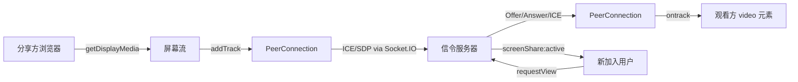

# 屏幕共享功能 — 完整开发记录

## 功能概述

为工单系统实现了完整的 WebRTC 实时屏幕共享功能，支持多人同时观看、支援模式、可拖拽布局调整、随时加入/退出观看等企业级特性。

---

## 核心架构

### 技术栈
- **视频传输**: WebRTC P2P（零服务器带宽消耗）
- **信令**: Socket.IO 事件中继（`ChatGateway`）
- **NAT 穿透**: Google STUN 服务器
- **状态管理**: React Hook + useRef 模式

---

## 修改文件清单

### 后端
| 文件 | 改动 |
|------|------|
| [chat.gateway.ts](file:///Users/yipang/Documents/code/callcenter/backend/src/modules/chat/chat.gateway.ts) | 添加 `activeSharers` Map 跟踪活跃共享；6 个信令事件处理器；`joinRoom` 时推送活跃共享状态；断线自动清理 |

### 前端
| 文件 | 改动 |
|------|------|
| [useScreenShare.ts](file:///Users/yipang/Documents/code/callcenter/frontend/src/hooks/useScreenShare.ts) | 完整 WebRTC Hook — PeerConnection 生命周期、多观看者支持、`joinViewing()` 随时加入、`hasActiveShare` 状态 |
| [ScreenSharePanel.tsx](file:///Users/yipang/Documents/code/callcenter/frontend/src/components/ScreenSharePanel.tsx) | 视频渲染组件 — 支援模式、全屏、缩放、可拖拽宽度、安全播放策略 |
| [TicketDetail.tsx](file:///Users/yipang/Documents/code/callcenter/frontend/src/pages/Tickets/TicketDetail.tsx) | 集成 — 支援模式状态、拖拽分割线、绿色闪烁图标、自动退出支援模式 |
| [index.css](file:///Users/yipang/Documents/code/callcenter/frontend/src/index.css) | 支援模式布局、拖拽分割线、pulse-glow 动画、移动端适配 |

---

## 功能特性

### 1. 屏幕共享核心
- 任何人可发起/停止屏幕共享
- 支持高质量画面（1920×1080, 15fps）
- 浏览器原生"停止共享"按钮联动

### 2. 多人同时观看
- 分享方为每个观看者创建独立 PeerConnection
- 后端 `activeSharers` Map 跟踪活跃共享会话
- 新用户加入房间自动收到 `screenShare:active` 通知

### 3. 随时加入/退出
- 聊天头部 🖥️ 图标三种状态：
  - **灰色**：无人分享 → 点击发起
  - **绿色闪烁** (pulse-glow)：有人分享但未观看 → 点击加入
  - **绿色常亮**：正在分享/观看
- 退出观看后保留 `hasActiveShare` 状态，可随时重新加入
- 分享方断线时自动清理所有观看者状态

### 4. 支援模式
- 点击 🎧 按钮进入全屏双面板布局
- 左侧视频（默认 70%）+ 右侧聊天（默认 30%）
- 可拖拽分割线调整比例（40%–85%）
- 分享结束自动退出支援模式

### 5. 视频播放策略
- `autoPlay` + `muted` + `playsInline` 属性组合
- callback ref 处理首次挂载绑定
- useEffect 处理流对象更新
- `safePlay()` 延迟 100ms 播放，静默忽略 AbortError

---

## 已解决的问题

| 问题 | 根因 | 修复 |
|------|------|------|
| 黑屏 | `ontrack` 中 `event.streams` 为空 | 兜底构建 MediaStream |
| 第二观看者黑屏 | `NotAllowedError` 自动播放被阻止 | 添加 `muted` 属性 |
| AbortError | callback ref 和 useEffect 同时调用 play() | 分离职责 + safePlay() |
| useEffect 重复注册 | 依赖 `createPeerConnection` 导致频繁重建 | 改用 ref 模式 |
| 退出后无法重新观看 | stopViewing 清除了所有状态 | 分离 cleanupViewer / cleanupAll |
| 分享方断线未通知 | handleDisconnect 未清理共享状态 | 遍历 activeSharers 清理+广播 |
| 支援模式布局残留 | supportMode 未随共享结束重置 | useEffect 监听 isSharing/isViewing |

---

## 验证结果

- ✅ 单人观看正常
- ✅ 多人同时观看正常（手机端也可）
- ✅ 退出后重新加入正常
- ✅ 支援模式 + 拖拽调整正常
- ✅ 分享方停止/断线 → 所有观看方自动退出
- ✅ 邀请专家功能正常（未受影响）
