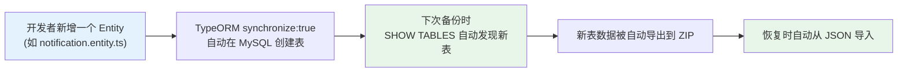

# 系统备份与恢复功能 — 可行性方案

## 一、项目现状分析

### 1.1 数据层全景

| 层级 | 技术 | 数据内容 | 当前规模 |
|------|------|---------|---------|
| **关系数据库** | MySQL (`callcenter`) | 全部业务数据 | 15 张表 |
| **对象存储** | 本地磁盘 (`oss/`) | 图片、附件 | 远程 1739 个文件 / 167MB |
| **搜索引擎** | Elasticsearch | 全文索引 | 启动时自动重建 |
| **缓存** | Redis | Session/临时状态 | 无需备份 |

### 1.2 数据库表清单（当前 15 张实体表 + 1 张关联表）

| # | 表名 | 用途 | 备份优先级 |
|---|------|------|-----------|
| 1 | `users` | 用户账号、密码、角色绑定 | 🔴 核心 |
| 2 | `roles` | 角色定义 | 🔴 核心 |
| 3 | `permissions` | 权限定义 | 🔴 核心 |
| 4 | `system_settings` | AI 模型配置、企业信息、安全设置 | 🔴 核心 |
| 5 | `tickets` | 工单主体 | 🔴 核心 |
| 6 | `ticket_categories` | 工单分类树 | 🔴 核心 |
| 7 | `ticket_participants` | 工单参与人关联表 (ManyToMany) | 🔴 核心 |
| 8 | `ticket_read_states` | 工单已读状态 | 🟡 辅助 |
| 9 | `messages` | 聊天消息（含文件引用） | 🔴 核心 |
| 10 | `posts` | BBS 帖子 | 🔴 核心 |
| 11 | `post_comments` | BBS 评论 | 🔴 核心 |
| 12 | `bbs_sections` | BBS 板块 | 🔴 核心 |
| 13 | `bbs_tags` | BBS 标签 | 🔴 核心 |
| 14 | `bbs_subscriptions` | BBS 订阅关系 | 🟡 辅助 |
| 15 | `knowledge_docs` | AI 知识库文档 | 🔴 核心 |
| 16 | `audit_logs` | 操作审计日志 | 🟢 可选 |

### 1.3 对象文件分析（远程服务器 `oss/` 目录）

| 文件类型 | 数量 | 说明 |
|---------|------|------|
| 图片 (`.png`, `.jpg`, `.jpeg`, `.gif`, `.webp`, `.svg`) | ~1716 个 | BBS 帖子配图、聊天截图、Word 导入图片等 |
| 附件 (`.pdf`, `.docx`, `.xlsx`, `.pptx`, `.zip`, `.md`, `.sh` 等) | ~23 个 | 聊天中上传的文档附件 |
| **合计** | **~1739 个** | **~167MB** |

---

## 二、核心设计理念：零维护的自动表发现

> [!IMPORTANT]
> **以后新增任何功能/实体表，备份功能都不需要改一行代码，完全自动适配。**

### 2.1 自动发现机制

不在代码中硬编码任何表名列表。而是在备份和恢复时，**动态地从两个源头发现所有需要处理的表**：

| 阶段 | 发现方式 | 技术实现 | 覆盖范围 |
|------|---------|---------|---------|
| **备份时** | 通过 MySQL 查询 `SHOW TABLES` | `DataSource.query("SHOW TABLES")` | 自动包含所有当前存在的表（含 TypeORM 自动生成的关联表） |
| **恢复时** | 遍历 ZIP 中 `database/` 目录下的所有 `.json` 文件 | 读取解压后的文件列表 | 自动恢复备份中存在的所有表 |

**伪代码示意：**

```typescript
// 备份：自动发现所有表
async createBackup(options) {
  const connection = this.dataSource;

  // 动态获取数据库中所有表名，无需手动维护
  const tables = await connection.query('SHOW TABLES');
  const tableNames: string[] = tables.map(row => Object.values(row)[0]);

  // 排除审计日志（如果用户未勾选）
  const excludeTables = options.includeAuditLogs ? [] : ['audit_logs'];
  const targetTables = tableNames.filter(t => !excludeTables.includes(t));

  for (const tableName of targetTables) {
    const rows = await connection.query(`SELECT * FROM \`${tableName}\``);
    // 写入 database/{tableName}.json
    archive.append(JSON.stringify(rows, null, 2), { name: `database/${tableName}.json` });
  }
}

// 恢复：自动处理 ZIP 中包含的所有表
async restoreBackup(zipPath) {
  // 1. 先禁用外键约束
  await connection.query('SET FOREIGN_KEY_CHECKS = 0');

  // 2. 获取当前数据库中所有表并全部清空
  const currentTables = await connection.query('SHOW TABLES');
  for (const table of currentTables) {
    await connection.query(`TRUNCATE TABLE \`${tableName}\``);
  }

  // 3. 遍历 ZIP 中的所有 JSON 文件，逐表导入
  const jsonFiles = fs.readdirSync(extractDir + '/database');
  for (const file of jsonFiles) {
    const tableName = file.replace('.json', '');
    const rows = JSON.parse(fs.readFileSync(...));
    if (rows.length > 0) {
      // 批量插入
      await connection.query(`INSERT INTO \`${tableName}\` ...`);
    }
  }

  // 4. 重新启用外键约束
  await connection.query('SET FOREIGN_KEY_CHECKS = 1');
}
```

### 2.2 为什么这样做可行？

| 顾虑 | 解释 |
|------|------|
| **外键依赖顺序怎么办？** | 恢复时先执行 `SET FOREIGN_KEY_CHECKS = 0`，MySQL 会暂时忽略外键约束，导入全部完成后再恢复。无需关心顺序 |
| **新表有新字段怎么办？** | 使用原生 `SELECT *` + `INSERT INTO ... SET` 的 key-value 方式，字段名从 JSON 的 key 动态获取 |
| **TypeORM 自动生成的关联表（如 `ticket_participants`）呢？** | `SHOW TABLES` 会返回数据库中所有表，包括 TypeORM 自动生成的 ManyToMany 中间表 |
| **备份包中有表但当前数据库没有这张表？** | 恢复时跳过不存在的表并在日志中 warn，不影响其余数据 |
| **当前数据库有新表但备份包里没有？** | 该表会被 TRUNCATE 清空（因为是全量恢复），这是正确行为 |

### 2.3 唯一需要配置的：排除列表

只维护一个"可选排除"列表，用于让管理员在 UI 上选择是否包含某些通常不必要的大表：

```typescript
// 仅此一处配置，且只用于 UI 展示勾选框，不影响自动发现
const OPTIONAL_TABLES = {
  'audit_logs': { label: '审计日志', defaultInclude: false },
};
```

> 不在排除列表中的所有表 = 默认全部备份，新增的表自动包含。

---

## 三、功能架构设计

### 3.1 备份 ZIP 包内部结构

```
backup_callcenter_20260422_185000.zip
├── manifest.json              # 备份元信息（版本、时间、选项、校验和）
├── database/
│   ├── users.json             # 每张表一个 JSON 文件
│   ├── roles.json             # （由 SHOW TABLES 动态发现，
│   ├── permissions.json       #   未来新增表自动出现在这里）
│   ├── system_settings.json
│   ├── tickets.json
│   ├── ...                    # 所有其他表
│   └── audit_logs.json        # 仅当选择备份审计日志时包含
├── oss_images/                # 仅当选择备份图片时包含
│   ├── xxx-xxx.png
│   └── ...
└── oss_files/                 # 仅当选择备份附件时包含
    ├── xxx-xxx.pdf
    └── ...
```

### 3.2 `manifest.json` 示例

```json
{
  "version": "1.0",
  "appName": "CallCenter",
  "createdAt": "2026-04-22T18:50:00.000Z",
  "options": {
    "includeImages": true,
    "includeFiles": true,
    "includeAuditLogs": false
  },
  "statistics": {
    "tables": ["users", "roles", "permissions", "..."],
    "tableRecordCounts": {
      "users": 12,
      "roles": 3,
      "messages": 8500,
      "...": "..."
    },
    "totalRecords": 12580,
    "imageCount": 1716,
    "fileCount": 23,
    "totalSizeBytes": 175000000
  },
  "checksums": {
    "database/users.json": "sha256:xxxx...",
    "database/messages.json": "sha256:xxxx..."
  }
}
```

### 3.3 整体流程图

```mermaid
flowchart TB
    subgraph 备份流程
        A[管理员点击备份] --> B[选择备份选项]
        B --> C[后端开始导出]
        C --> D["SHOW TABLES 动态发现所有表"]
        D --> E[逐表 SELECT * 导出为 JSON]
        E --> F{包含图片?}
        F -->|是| G[扫描 oss/ 收集图片文件]
        F -->|否| H[跳过]
        G --> I{包含附件?}
        H --> I
        I -->|是| J[扫描 oss/ 收集非图片文件]
        I -->|否| K[跳过]
        J --> L[生成 manifest.json]
        K --> L
        L --> M[打包成 ZIP 并返回下载链接]
    end

    subgraph 恢复流程
        N[管理员上传 ZIP] --> O[后端解压验证]
        O --> P[校验 manifest.json]
        P --> Q["SET FOREIGN_KEY_CHECKS = 0"]
        Q --> R[TRUNCATE 当前所有表]
        R --> S["遍历 database/*.json 逐表 INSERT"]
        S --> T{包含 oss_images/?}
        T -->|是| U[恢复图片到 oss/]
        T -->|否| V[跳过]
        U --> W{包含 oss_files/?}
        V --> W
        W -->|是| X[恢复附件到 oss/]
        W -->|否| Y[跳过]
        X --> Z["SET FOREIGN_KEY_CHECKS = 1"]
        Y --> Z
        Z --> AA[重建 Elasticsearch 索引]
        AA --> AB[恢复完成, 强制登出所有用户]
    end
```



---

## 四、后端实现方案

### 4.1 新增模块

#### [NEW] `backend/src/modules/backup/backup.module.ts`
- 注册 `BackupService` 和 `BackupController`
- 注入 `DataSource`（TypeORM 原生连接，用于执行 `SHOW TABLES` 等原生 SQL）
- 注入 `SearchModule` 用于恢复后重建索引

#### [NEW] `backend/src/modules/backup/backup.service.ts`

**核心方法：**

| 方法 | 功能 | 关键逻辑 |
|------|------|---------|
| `createBackup(options)` | 创建备份 | 1. `SHOW TABLES` 动态获取全部表<br>2. 逐表 `SELECT *` 导出 JSON<br>3. 按选项扫描 oss/ 收集文件<br>4. 用 `archiver` 打包 ZIP |
| `restoreBackup(zipPath)` | 恢复备份 | 1. 解压 ZIP 并校验 manifest<br>2. `SET FOREIGN_KEY_CHECKS = 0`<br>3. TRUNCATE 所有现有表<br>4. 遍历 `database/*.json` 逐表 INSERT<br>5. 恢复 OSS 文件<br>6. `SET FOREIGN_KEY_CHECKS = 1`<br>7. 重建 ES 索引 |
| `getStats()` | 获取当前数据统计 | 返回各表行数和 oss/ 文件统计，用于前端显示 |
| `listBackups()` | 列出历史备份 | 扫描备份目录下的 ZIP 文件并读取其 manifest |
| `deleteBackup(filename)` | 删除指定备份 | 删除对应 ZIP 文件 |

**关键技术点：**
- **表发现**：`SHOW TABLES` 自动获取，不硬编码任何表名
- **字段发现**：从 JSON 数据的 key 动态构建 INSERT 语句，不硬编码任何列名
- **外键安全**：恢复前 `SET FOREIGN_KEY_CHECKS = 0`，恢复后 `SET FOREIGN_KEY_CHECKS = 1`
- **批量插入**：每 500 行一批 INSERT，避免单次 SQL 过大
- **流式打包**：使用 `archiver` npm 包（支持流式写入，内存友好）
- **流式解压**：使用 `unzipper` npm 包
- **校验和**：使用 `crypto.createHash('sha256')` 生成文件完整性校验

#### [NEW] `backend/src/modules/backup/backup.controller.ts`

| 端点 | 方法 | 功能 | 权限 |
|------|------|------|------|
| `GET /api/backup/stats` | GET | 获取当前数据统计信息 | admin only |
| `POST /api/backup/create` | POST | 创建备份 | admin only |
| `GET /api/backup/download/:filename` | GET | 下载备份包 | admin only |
| `POST /api/backup/restore` | POST | 上传并恢复 | admin only |
| `GET /api/backup/list` | GET | 列出历史备份 | admin only |
| `DELETE /api/backup/:filename` | DELETE | 删除备份 | admin only |

### 4.2 需要修改的现有文件

#### [MODIFY] [app.module.ts](file:///Users/yipang/Documents/code/callcenter/backend/src/app.module.ts)
- 在 `imports` 数组中加入 `BackupModule`

### 4.3 新增依赖

```bash
npm install archiver @types/archiver unzipper @types/unzipper
```

---

## 五、前端实现方案

### 5.1 新增 Admin Tab

#### [NEW] `frontend/src/pages/Admin/components/BackupTab.tsx`

**UI 设计：**

```
┌─────────────────────────────────────────────────────┐
│  💾 系统备份与恢复                                      │
├─────────────────────────────────────────────────────┤
│                                                     │
│  ┌─ 创建备份 ─────────────────────────────────────┐  │
│  │                                                │  │
│  │  当前数据概况：                                  │  │
│  │  📊 数据库：16 张表，共 12580 条记录             │  │
│  │  🖼️ 图片：1716 个文件 (140MB)                   │  │
│  │  📎 附件：23 个文件 (27MB)                      │  │
│  │                                                │  │
│  │  备份选项：                                     │  │
│  │  ☑ 数据库（自动包含所有业务表）         [必选]   │  │
│  │  ☑ 图片文件                                    │  │
│  │  ☑ 文档附件                                    │  │
│  │  ☐ 审计日志                                    │  │
│  │                                                │  │
│  │  [🔒 立即备份]                                  │  │
│  │                                                │  │
│  └────────────────────────────────────────────────┘  │
│                                                     │
│  ┌─ 历史备份 ─────────────────────────────────────┐  │
│  │                                                │  │
│  │  📦 backup_20260422_185000.zip    150MB         │  │
│  │     2026-04-22 18:50  含16张表+图片+附件        │  │
│  │     [⬇ 下载]  [🗑 删除]                         │  │
│  │                                                │  │
│  │  📦 backup_20260420_120000.zip     2MB          │  │
│  │     2026-04-20 12:00  含16张表（仅数据库）       │  │
│  │     [⬇ 下载]  [🗑 删除]                         │  │
│  │                                                │  │
│  └────────────────────────────────────────────────┘  │
│                                                     │
│  ┌─ 恢复系统 ─────────────────────────────────────┐  │
│  │                                                │  │
│  │  ⚠️ 警告：恢复操作将清空当前所有数据并替换为      │  │
│  │  备份中的数据。此操作不可逆！                     │  │
│  │                                                │  │
│  │  [📂 选择备份文件...]                            │  │
│  │                                                │  │
│  │  上传进度：████████████░░░░ 75%                  │  │
│  │  恢复状态：正在导入消息数据 (8/16)...             │  │
│  │                                                │  │
│  └────────────────────────────────────────────────┘  │
│                                                     │
└─────────────────────────────────────────────────────┘
```

**交互逻辑：**
- 页面加载时调用 `GET /api/backup/stats` 获取当前数据概况
- 点击"立即备份"后显示 loading 进度提示
- 备份完成后自动刷新历史列表
- 恢复前弹出二次确认 Modal（需要输入 `RESTORE` 确认文字）
- 恢复过程中显示实时进度
- 恢复完成后强制跳转到登录页

### 5.2 修改现有文件

#### [MODIFY] [Admin/index.tsx](file:///Users/yipang/Documents/code/callcenter/frontend/src/pages/Admin/index.tsx)
- 在 `Tabs.items` 数组中新增 "备份恢复" Tab
- 引入 `BackupTab` 组件

#### [MODIFY] `frontend/src/services/api.ts`
- 新增 `backupAPI` 相关方法（stats, create, download, restore, list, delete）

---

## 六、难度评估

### 6.1 总体评分

| 维度 | 评分 | 说明 |
|------|------|------|
| **后端复杂度** | ⭐⭐⭐☆☆ (3/5) | 核心是原生 SQL 遍历 + ZIP 打包，技术成熟 |
| **前端复杂度** | ⭐⭐☆☆☆ (2/5) | 主要是表单 + 文件上传下载 + 进度展示 |
| **数据完整性风险** | ⭐⭐⭐☆☆ (3/5) | 通过禁用外键约束，恢复顺序不再是问题 |
| **可维护性** | ⭐⭐⭐⭐⭐ (5/5) | 自动表发现，新增表零维护 |
| **耗时评估** | ~3-4 小时 | 含开发 + 联调 + 测试 |

### 6.2 风险点与应对策略

| 风险 | 影响 | 应对策略 |
|------|------|---------|
| **恢复时外键冲突** | 导入顺序不对导致失败 | `SET FOREIGN_KEY_CHECKS = 0` 彻底绕过 |
| **大文件 ZIP 上传超时** | 包含全部图片时 ZIP 可达 150MB+ | 流式上传；Nginx 调大 `client_max_body_size` |
| **备份过程中有新数据写入** | 可能导致数据不一致 | manifest 记录时间戳，提示是时间点快照 |
| **恢复后 Elasticsearch 不同步** | 搜索结果不准确 | 恢复完成后自动重建全部索引 |
| **恢复后 JWT Token 失效** | 旧 Token 对应的用户 ID 可能已变 | 恢复完成后强制重新登录 |
| **密码哈希兼容** | 用户密码是 bcrypt 哈希 | JSON 直接保存哈希值，恢复后无需重新加密 |
| **新表在备份后才创建** | 恢复旧备份时新表会被清空 | 正确行为：全量恢复就是还原到备份时刻 |

### 6.3 新增表的自动适配总结



**结论：开发者只管加 Entity，备份功能零修改。**

---

## 七、Open Questions

> [!IMPORTANT]
> **关于备份存放位置**：备份 ZIP 文件是存放在服务器本地目录（如 `/var/www/callcenter/backend/backups/`），还是也需要支持下载到管理员本地电脑？目前方案是两者都支持：服务器端保留历史备份列表，同时提供下载按钮。

> [!IMPORTANT]
> **关于恢复时的 Nginx 配置**：如果包含全部图片（~167MB），ZIP 文件可能超过 Nginx 默认的上传限制。需要确认远程服务器 Nginx 的 `client_max_body_size` 是否已经调大。如果没有，恢复功能需要在部署时一并调整。

> [!NOTE]
> **关于审计日志**：审计日志通常随时间积累会变得非常大。方案中默认将其设为"可选备份"，即默认不勾选。你觉得这个设计是否合理？

---

## 八、验证计划

### 自动化验证
1. 在本地数据库中执行完整备份流程，验证 ZIP 包结构正确
2. 删除本地数据库数据后执行恢复，验证所有表数据恢复正常
3. 验证 OSS 文件正确复制到 `oss/` 目录
4. 验证恢复后系统能正常登录和使用

### 手动验证
1. 在远程服务器上执行完整备份 → 下载 → 删除数据 → 上传恢复的全流程
2. 验证恢复后 BBS 帖子中的图片能正常显示
3. 验证恢复后全站搜索功能正常

### 自动适配验证
1. 手动创建一张测试表，执行备份，确认新表出现在 ZIP 中
2. 恢复该备份，确认测试表数据正确恢复
