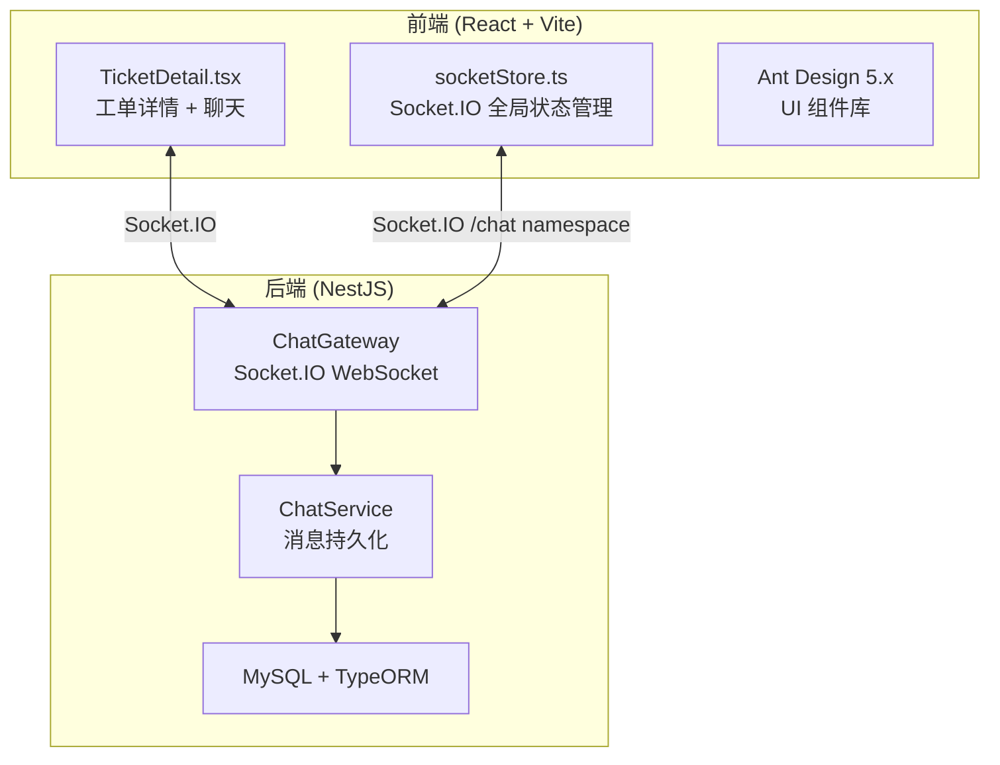
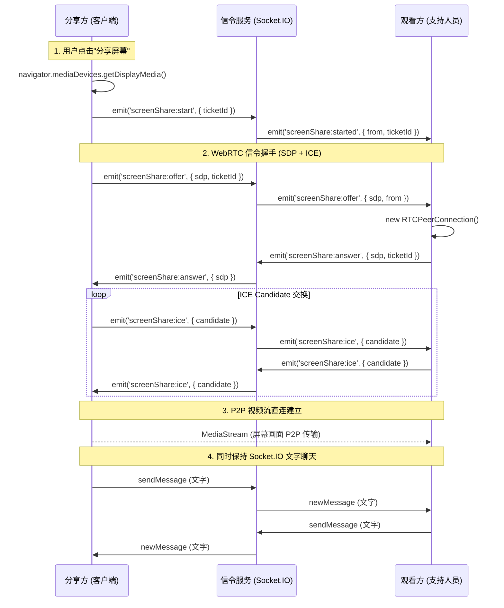
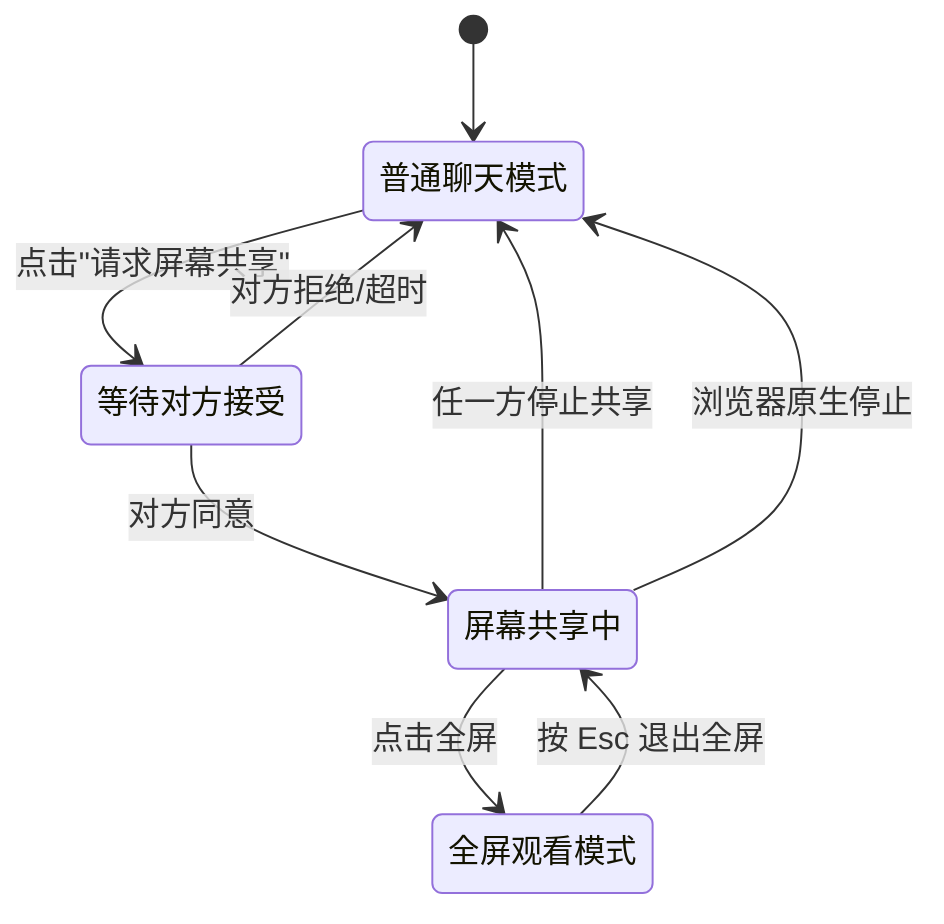

# 远程屏幕共享功能 — 可行性分析报告与实施方案

## 一、需求梳理

根据您的描述，核心需求如下：

| # | 需求要点 | 优先级 |
|---|---------|--------|
| 1 | 工单支持人员可实时观看客户/对方的屏幕画面 | P0 |
| 2 | 支持全屏观看 / 最大化屏幕显示，确保清晰度 | P0 |
| 3 | 屏幕共享期间保留聊天输入框，可边看边交流 | P0 |
| 4 | 分享屏幕的一方也能看到聊天框，实时双向交流 | P1 |
| 5 | 远程指导操作（语音/画笔标注等扩展能力） | P2（后续扩展） |

---

## 二、技术可行性分析

### 2.1 现有系统架构



**现有基础优势：**
- ✅ **Socket.IO 双向实时通信已就绪** — `/chat` namespace，支持 Room 机制
- ✅ **工单房间隔离机制完善** — `ticket_{id}` Room，包含锁定/踢人/权限控制
- ✅ **在线用户追踪已实现** — `roomUsers` 广播，头像组显示
- ✅ **外部用户（external）鉴权链完整** — JWT Token + allowedTicketId

### 2.2 屏幕共享技术方案对比

| 方案 | 技术栈 | 延迟 | 质量 | 部署复杂度 | 成本 |
|-----|--------|------|------|-----------|------|
| **A. WebRTC (推荐)** | 浏览器原生 API + 信令服务 | ≤200ms | 高（自适应码率） | ⭐⭐ 中等 | 免费 |
| B. 截图流 (Canvas) | 定时截屏 + Socket传输 | 500ms–2s | 中（有损压缩） | ⭐ 简单 | 免费 |
| C. 第三方 SaaS | ToDesk/向日葵 SDK | ≤100ms | 极高 | ⭐ 简单 | 按席收费 |

> [!IMPORTANT]
> **推荐方案 A：WebRTC + Socket.IO 信令**
>
> 理由：
> 1. WebRTC 是浏览器内置标准 API，**无需安装任何客户端或插件**
> 2. P2P 传输延迟极低（通常 < 200ms），画质自适应
> 3. 信令通道可直接复用现有 Socket.IO 基础设施，**后端改动最小**
> 4. `getDisplayMedia()` API 支持选择共享 **整个屏幕 / 应用窗口 / 浏览器标签页**
> 5. 完全免费，无第三方依赖

### 2.3 WebRTC 屏幕共享架构设计



> [!NOTE]
> **核心优势**：视频流走 P2P（点对点），不经过服务器，**不消耗服务器带宽**。信令仅在建连阶段使用 Socket.IO 做中介，之后视频流完全是客户端之间直传。

---

## 三、UI 交互方案设计

### 3.1 观看方（支持人员）视角

```
┌──────────────────────────────────────────────────────────────┐
│  💬 实时沟通              👥 在线(3)  🖥️ 屏幕共享中  🔒  📥  │ ← 聊天头部
├──────────────────────────────────────────────────────────────┤
│                                                              │
│  ┌──────────────────────────────────────────────────────┐    │
│  │                                                      │    │
│  │              远程屏幕画面 (video)                      │    │
│  │         (可拖拽调整大小 / 全屏切换)                     │    │
│  │                                                      │    │
│  │                                                      │    │
│  └──────────────────────────────────────────────────────┘    │
│                                                              │
│  ┌ 聊天记录区 (可折叠/半透明叠加) ──────────────────────────┐  │
│  │  张三: 请打开系统设置                                    │  │
│  │  李四: 好的，我正在操作                                  │  │
│  └──────────────────────────────────────────────────────────┘  │
├──────────────────────────────────────────────────────────────┤
│  [📎] [🖼️]  输入消息... (回车发送)              [⏎ 发送]    │ ← 输入区域始终可用
└──────────────────────────────────────────────────────────────┘
```

**全屏模式**：点击全屏按钮后，屏幕画面占据整个视口，聊天区以半透明浮层叠在底部右侧，可展开/折叠。

### 3.2 分享方（客户/操作者）视角

```
┌──────────────────────────────────────────────────────────────┐
│  💬 实时沟通              👥 在线(3)  🖥️ 正在分享屏幕  [停止] │
├──────────────────────────────────────────────────────────────┤
│                                                              │
│  ┌ 聊天记录区 (保持完整显示) ──────────────────────────────┐  │
│  │  张三(支持): 请打开终端，输入 ifconfig                   │  │
│  │  我: 好的                                               │  │
│  │  张三(支持): 看到了，请把第三行 IP 告诉我                 │  │
│  └──────────────────────────────────────────────────────────┘  │
│                                                              │
│  ┌ 本地预览小窗 ─────────┐                                   │
│  │  (自己屏幕的实时缩略图) │  ← 可选，帮助确认分享范围         │
│  └───────────────────────┘                                   │
├──────────────────────────────────────────────────────────────┤
│  [📎] [🖼️]  输入消息...                          [⏎ 发送]    │
└──────────────────────────────────────────────────────────────┘
```

### 3.3 交互状态流转



---

## 四、详细实施方案

### 4.1 后端改造（信令服务）

> [!NOTE]
> 后端改动非常轻量 — 仅在 ChatGateway 中增加 5 个信令事件转发，**不涉及数据库改动**，不需要新建 Entity/Module。

#### [MODIFY] [chat.gateway.ts](file:///Users/yipang/Documents/code/callcenter/backend/src/modules/chat/chat.gateway.ts)

在现有 ChatGateway 中新增以下 WebSocket 事件处理：

```typescript
// ==================== 屏幕共享信令 ====================

@SubscribeMessage('screenShare:start')
handleScreenShareStart(client: Socket, data: { ticketId: number }) {
  // 通知房间内所有人：有人开始共享屏幕
  const roomName = `ticket_${data.ticketId}`;
  client.to(roomName).emit('screenShare:started', {
    ticketId: data.ticketId,
    from: (client as any).userId,
    fromName: (client as any).realName || (client as any).displayName || (client as any).username,
  });
}

@SubscribeMessage('screenShare:stop')
handleScreenShareStop(client: Socket, data: { ticketId: number }) {
  const roomName = `ticket_${data.ticketId}`;
  client.to(roomName).emit('screenShare:stopped', {
    ticketId: data.ticketId,
    from: (client as any).userId,
  });
}

@SubscribeMessage('screenShare:offer')
handleScreenShareOffer(client: Socket, data: { ticketId: number; sdp: any; to: number }) {
  // 将 SDP Offer 转发给指定观看者
  this.server.to(`user_${data.to}`).emit('screenShare:offer', {
    ticketId: data.ticketId,
    sdp: data.sdp,
    from: (client as any).userId,
  });
}

@SubscribeMessage('screenShare:answer')
handleScreenShareAnswer(client: Socket, data: { ticketId: number; sdp: any; to: number }) {
  this.server.to(`user_${data.to}`).emit('screenShare:answer', {
    ticketId: data.ticketId,
    sdp: data.sdp,
    from: (client as any).userId,
  });
}

@SubscribeMessage('screenShare:ice')
handleScreenShareIce(client: Socket, data: { ticketId: number; candidate: any; to: number }) {
  this.server.to(`user_${data.to}`).emit('screenShare:ice', {
    ticketId: data.ticketId,
    candidate: data.candidate,
    from: (client as any).userId,
  });
}
```

---

### 4.2 前端改造

#### [NEW] `frontend/src/hooks/useScreenShare.ts`

封装 WebRTC 屏幕共享的核心 Hook：

- `startSharing()` — 调用 `getDisplayMedia()` 获取屏幕流，创建 RTCPeerConnection
- `stopSharing()` — 关闭流和 PeerConnection
- `handleOffer()` / `handleAnswer()` / `handleIce()` — 处理信令
- 状态暴露：`isSharing`, `isViewing`, `remoteStream`, `localStream`

#### [NEW] `frontend/src/components/ScreenSharePanel.tsx`

屏幕共享视频面板组件：

- 渲染 `<video>` 元素播放 remoteStream
- 全屏切换按钮 (使用 `Element.requestFullscreen()`)
- 分享方本地预览小窗
- 停止共享按钮
- 连接状态指示（连接中/已连接/断开）

#### [MODIFY] [TicketDetail.tsx](file:///Users/yipang/Documents/code/callcenter/frontend/src/pages/Tickets/TicketDetail.tsx)

在工单详情页集成屏幕共享功能：

1. **聊天头部**：增加「🖥️ 屏幕共享」按钮
2. **聊天区域**：在屏幕共享激活时，动态调整布局：
   - 上方显示 `ScreenSharePanel`（视频画面）
   - 下方保留聊天消息区 + 输入框
   - 通过可拖拽分割线调整比例
3. **全屏模式**：视频画面全屏，聊天区以半透明浮层悬浮
4. **分享方**：聊天区保持完整，顶部显示「正在分享屏幕」状态条 + 停止按钮

#### [MODIFY] `frontend/src/index.css`

新增屏幕共享相关样式：
- `.screen-share-panel` — 视频面板
- `.screen-share-overlay` — 全屏模式下的聊天浮层
- `.screen-share-toolbar` — 控制工具栏
- `.screen-share-minipreview` — 分享方的本地预览小窗
- 响应式布局适配

---

## 五、TURN/STUN 服务器配置

> [!WARNING]
> **NAT 穿透问题**：在企业内网环境中，P2P 直连可能因对称 NAT / 防火墙限制而失败。需要配置 STUN/TURN 服务器。

### 5.1 STUN（免费）

使用 Google 公共 STUN 服务器即可：

```javascript
const config = {
  iceServers: [
    { urls: 'stun:stun.l.google.com:19302' },
    { urls: 'stun:stun1.l.google.com:19302' },
  ]
};
```

### 5.2 TURN（需自建 — 可选）

如果内网环境严格，P2P 无法直连，需要 TURN 中继：

```bash
# 使用 coturn（开源 TURN 服务器）
docker run -d --name coturn \
  -p 3478:3478 -p 3478:3478/udp \
  -p 49152-65535:49152-65535/udp \
  coturn/coturn \
  -n --log-file=stdout \
  --min-port=49152 --max-port=65535 \
  --realm=callcenter.local \
  --user=callcenter:your-password
```

> [!TIP]
> **对于你们的场景**（支持人员和客户大概率在同一内网或通过 VPN 连接），STUN 通常足够。TURN 可作为降级方案，在 P2P 连接失败时自动切换。

---

## 六、分阶段实施计划

### Phase 1：核心屏幕共享（预计 2-3 天）

- [ ] 后端 ChatGateway 增加 5 个信令事件
- [ ] 前端 `useScreenShare` Hook 实现
- [ ] 前端 `ScreenSharePanel` 组件实现
- [ ] TicketDetail 页面集成

### Phase 2：UI 优化与体验增强（预计 1-2 天）

- [ ] 全屏模式 + 聊天浮层叠加
- [ ] 可拖拽调整视频/聊天比例
- [ ] 分享方本地预览小窗
- [ ] 屏幕共享状态在聊天区显示系统消息（"张三开始了屏幕共享"）
- [ ] 移动端适配

### Phase 3：安全与健壮性（预计 1 天）

- [ ] 权限控制：仅工单参与者可发起/观看
- [ ] 房间锁定时的屏幕共享处理
- [ ] 外部用户（external）屏幕共享权限
- [ ] 连接断开自动重连 / 优雅降级
- [ ] TURN 服务器配置（如需要）

### Phase 4：扩展功能（可选）

- [ ] 画笔标注（在远程画面上标记）
- [ ] 语音通话（WebRTC 同时支持音频流）
- [ ] 多人同时观看（1:N 屏幕共享）
- [ ] 远程控制（需额外权限确认）

---

## 七、风险评估

| 风险项 | 影响 | 缓解策略 |
|--------|------|----------|
| NAT 穿透失败导致无法连接 | 高 | 配置 TURN 中继服务器作为 fallback |
| 浏览器兼容性 | 低 | `getDisplayMedia()` 已被所有现代浏览器支持 (Chrome 72+, Firefox 66+, Edge 79+, Safari 13+) |
| 大分辨率屏幕带宽消耗 | 中 | WebRTC 自适应码率 + 允许用户选择共享区域（窗口而非全屏） |
| 移动端不支持屏幕共享 | 中 | 移动端仅支持"观看"，不支持"共享"，UI 上做相应提示 |
| 多人同时共享冲突 | 低 | 限制每个房间同一时间只允许一人共享屏幕 |

---

## 八、开放性问题

> 以下问题已全部确认：

| # | 问题 | 确认结果 |
|---|------|----------|
| 1 | 使用场景 | ✅ **双向共享** — 支持人员和客户都需要能发起/观看屏幕共享 |
| 2 | 外部用户权限 | ✅ **需要** — 外部用户（客户）也需要有发起屏幕共享的权限 |
| 3 | TURN 中继 | ✅ **需要配置** — 客户可能在内网或互联网环境，NAT 穿透很重要 |
| 4 | 语音通话 | ✅ **将来需要** — 当前 Phase 不实现，但架构预留扩展能力 |
| 5 | 上线策略 | ✅ **分阶段上线** — 先完成 Phase 1 核心功能 |

---

## 九、验证计划

### 自动化测试
- 后端信令事件的 Socket.IO 集成测试
- 前端 `useScreenShare` Hook 的单元测试

### 手动验证
- 本地开发环境两个浏览器标签页互连测试
- 局域网跨机器（不同 IP）屏幕共享测试
- 全屏模式 + 聊天浮层交互体验验证
- 外部链接用户屏幕共享权限测试
- 移动端观看体验测试
